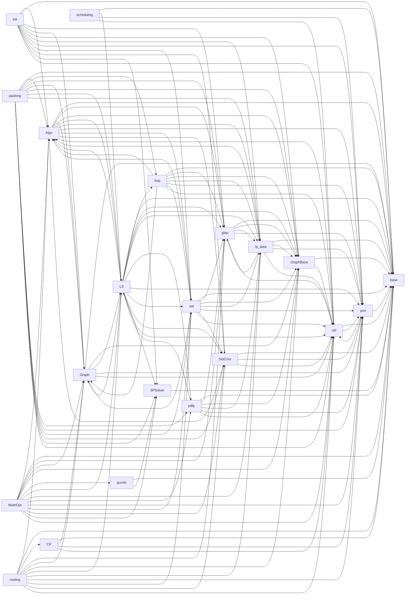
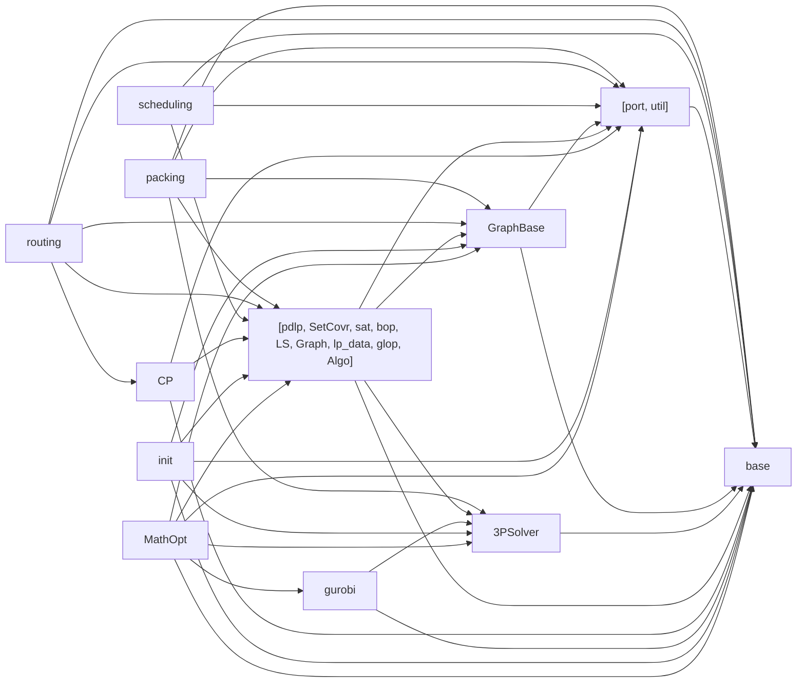
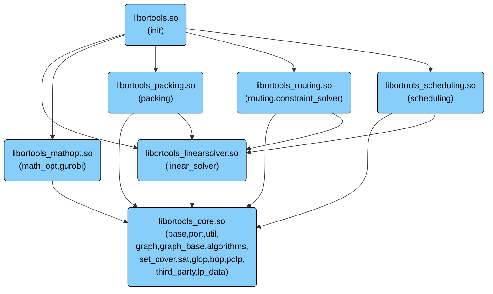

# OR-Tools Subdirectory Dependency Analysis

Using `bazel cquery somepath(kind('cc_library rule', //ortools/a/...), kind('cc_library rule', //ortools/b/...))`to find directory dependencies.

## Name Aliases Table

| Alias | Original Directory |
| --- | --- |
| `Algo` | `ortools/algorithms` |
| `CP` | `ortools/constraint_solver` |
| `Graph` | `ortools/graph` |
| `GraphBase` | `ortools/graph_base` |
| `LS` | `ortools/linear_solver` |
| `MathOpt` | `ortools/math_opt` |
| `SetCovr` | `ortools/set_cover` |
| `3PSolver` | `ortools/third_party_solvers` |

## Dependency Matrix Table

| Source \ Dep | Algo | base | bop | CP | glop | Graph | GraphBase | gurobi | init | LS | lp_data | MathOpt | packing | pdlp | port | routing | sat | scheduling | SetCovr | 3PSolver | util |
| --- | --- | --- | --- | --- | --- | --- | --- | --- | --- | --- | --- | --- | --- | --- | --- | --- | --- | --- | --- | --- | --- |
| **Algo** | - | Yes | . | . | Yes | Yes | Yes | . | . | Yes | Yes | . | . | . | Yes | . | Yes | . | Yes | . | Yes |
| **base** | . | - | . | . | . | . | . | . | . | . | . | . | . | . | . | . | . | . | . | . | . |
| **bop** | Yes | Yes | - | . | Yes | Yes | Yes | . | . | . | Yes | . | . | . | Yes | . | Yes | . | . | . | Yes |
| **CP** | . | Yes | . | - | . | Yes | . | . | . | . | . | . | . | . | Yes | . | . | . | . | . | Yes |
| **glop** | . | Yes | . | . | - | . | Yes | . | . | . | Yes | . | . | . | Yes | . | . | . | . | . | Yes |
| **Graph** | . | Yes | . | . | . | - | Yes | . | . | Yes | . | . | . | . | Yes | . | . | . | . | . | Yes |
| **GraphBase** | . | Yes | . | . | . | . | - | . | . | . | . | . | . | . | . | . | . | . | . | . | Yes |
| **gurobi** | . | Yes | . | . | . | . | . | - | . | . | . | . | . | . | . | . | . | . | . | Yes | . |
| **init** | Yes | Yes | . | . | Yes | Yes | Yes | . | - | . | Yes | . | . | . | Yes | . | Yes | . | Yes | Yes | Yes |
| **LS** | Yes | Yes | Yes | . | Yes | Yes | Yes | . | . | - | Yes | . | . | Yes | Yes | . | Yes | . | Yes | Yes | Yes |
| **lp_data** | Yes | Yes | . | . | Yes | . | Yes | . | . | . | - | . | . | . | Yes | . | . | . | . | . | Yes |
| **MathOpt** | Yes | Yes | . | . | Yes | Yes | Yes | Yes | . | Yes | Yes | - | . | Yes | Yes | . | Yes | . | Yes | Yes | Yes |
| **packing** | Yes | Yes | Yes | . | Yes | Yes | Yes | . | . | Yes | Yes | . | - | Yes | Yes | . | Yes | . | Yes | Yes | Yes |
| **pdlp** | . | Yes | . | . | Yes | . | Yes | . | . | Yes | Yes | . | . | - | Yes | . | . | . | . | . | Yes |
| **port** | . | Yes | . | . | . | . | . | . | . | . | . | . | . | . | - | . | . | . | . | . | Yes |
| **routing** | Yes | Yes | . | Yes | Yes | Yes | Yes | . | . | Yes | Yes | . | . | . | Yes | - | Yes | . | Yes | . | Yes |
| **sat** | Yes | Yes | . | . | Yes | Yes | Yes | . | . | . | Yes | . | . | . | Yes | . | - | . | Yes | . | Yes |
| **scheduling** | . | Yes | . | . | . | . | . | . | . | Yes | . | . | . | . | Yes | . | . | - | . | . | Yes |
| **SetCovr** | Yes | Yes | . | . | . | . | . | . | . | . | . | . | . | . | Yes | . | . | . | - | . | Yes |
| **3PSolver** | . | Yes | . | . | . | . | . | . | . | . | . | . | . | . | . | . | . | . | . | - | . |
| **util** | . | Yes | . | . | . | . | . | . | . | . | . | . | . | . | Yes | . | . | . | . | . | - |

## Dependency Graph

## Directory Pairs Cycles

Cycle: Algo <--> LS
Cycle: Algo <--> lp_data
Cycle: Algo <--> sat
Cycle: Algo <--> SetCovr
Cycle: glop <--> lp_data
Cycle: Graph <--> LS
Cycle: LS <--> pdlp
Cycle: port <--> util

## Strongly Connected Components (Cyclic Dependencies / Clusters)

- **Component 1:** `base` (base)
- **Component 2:** `port` (port), `util` (util)
- **Component 3:** `GraphBase` (graph_base)
- **Component 4:** `3PSolver` (third_party_solvers)
- **Component 5:** `pdlp` (pdlp), `SetCovr` (set_cover), `sat` (sat), `bop` (bop), `LS` (linear_solver), `Graph` (graph), `lp_data` (lp_data), `glop` (glop), `Algo` (algorithms)
- **Component 6:** `CP` (constraint_solver)
- **Component 7:** `gurobi` (gurobi)
- **Component 8:** `init` (init)
- **Component 9:** `MathOpt` (math_opt)
- **Component 10:** `packing` (packing)
- **Component 11:** `routing` (routing)
- **Component 12:** `scheduling` (scheduling)

# Strongly Connected Component (SCC) Condensation Graph

Each node represents an SCC. Multi-directory nodes indicate cyclic dependencies.

## Weakly Connected Components (Isolated Module Subgraphs)

note: we expect to found one cluster

- **Cluster 1:** `Algo`, `LS`, `routing`, `packing`, `Graph`, `glop`, `util`, `sat`, `port`, `bop`, `lp_data`, `SetCovr`, `init`, `base`, `GraphBase`, `MathOpt`, `scheduling`, `3PSolver`, `pdlp`, `CP`, `gurobi`

# CMake OR-Tools layout proposal

