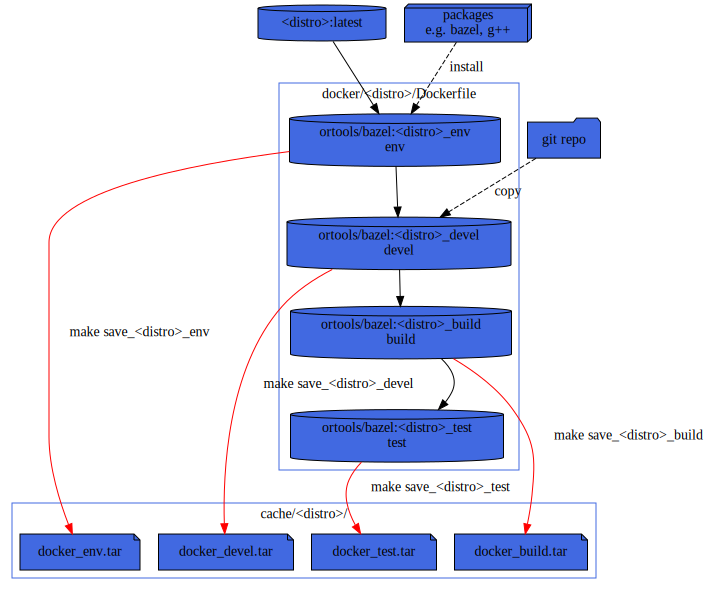

# CI: Makefile/Docker testing

To test the build on various distro, I'm using docker containers and a Makefile
for orchestration.

pros:
* You are independent of third party CI runner VM images (e.g. [github actions/virtual-environments](https://github.com/actions/virtual-environments)).
* You can run it locally on any host having a linux docker image support.
* Most CI provide runner with docker and Makefile installed.

cons:
* Only GNU/Linux distro supported.
* Could take few GiB (~30 GiB for all distro and all languages)
  * ~500MiB OS + C++/CMake tools,

## Usage

To get the help simply type:
```sh
make
```

note: you can also use from top directory
```sh
make --directory=bazel
```

### Example
For example to test inside an `Ubuntu` container:
```sh
make ubuntu_test
```

## Docker Layers

Dockerfile is split in several stages.


