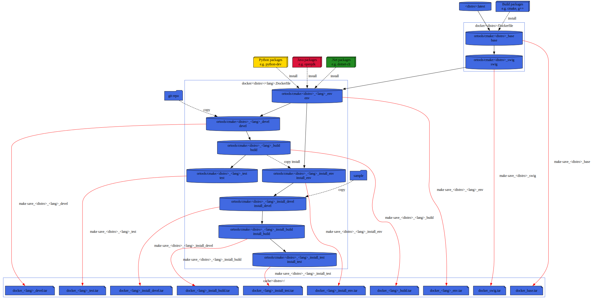

# CI: Makefile/Docker/Vagrant testing
To test the build on various distro, I'm using docker containers and a Makefile for orchestration.

pros:
* You are independent of third party CI runner config (e.g. github actions runners or Travis-CI VM images).
* You can run it locally on your linux system.
* Most CI provide runner with docker and Makefile already installed (e.g. tarvis-ci [minimal images](https://docs.travis-ci.com/user/languages/minimal-and-generic/).

cons:
* Only GNU/Linux distro supported.
* Could take few GiB (~30 GiB for all distro and all languages)
  * ~500MiB OS + C++/CMake tools,
  * ~150 MiB Python,
  * ~400 MiB dotnet-sdk,
  * ~400 MiB java-jdk.

# Usage
To get the help simply type:
```sh
make
```

note: you can also use from top directory
```sh
make --directory=cmake
```

## Example
For example to test `Python` inside an `Alpine` container:
```sh
make alpine_python_test
```

# Docker
[Docker](https://www.docker.com/resources/what-container) is a set of platform
as a service products that use OS-level virtualization to deliver software in
packages called containers.

You can find official base image on the Docker registry [Docker Hub](https://hub.docker.com/search?type=image)

## Layers
Dockerfile is splitted in several stages.


# Vagrant
[Vagrant](https://www.vagrantup.com/intro) is a tool for building and managing virtual machine environments in a single workflow.  
It is currently used to test FreeBSD inside a VirtualBox since we don't have any
FreeBSD machine.  
Vagrant call a base image a *box*.  
Vagrant call a container a *vagrant machine*.

You can find official box on the Vagrant registry [Vagrant Cloud](https://app.vagrantup.com/boxes/search)

note: Currently only github MacOS runner provide virtualization support (i.e. [VirtualBox](https://www.virtualbox.org/)).

## Basic usage
Once `vagrant` and `VirtualBox` are installed, all commands must be run where the `Vagrantfile` is
located.

Generate a `Vagrantfile` skeleton, e.g. using the box `generic/freebsd12`:
```sh
vagrant init generic/freebsd12
```

Build and run a new *vagrant machine*:
```sh
vagrant up
```
note: If you run `virtualbox` you should see it.

Connect to a *vagrant machine*:
```sh
vagrant ssh
[vagrant@freebsd12 ~]$ ...
```

Execute few commands:
```sh
vagrant ssh -c "pwd; ls project ..."
```

Stop and delete a *vagrant machine*:
```sh
vagrant destroy -f
```
