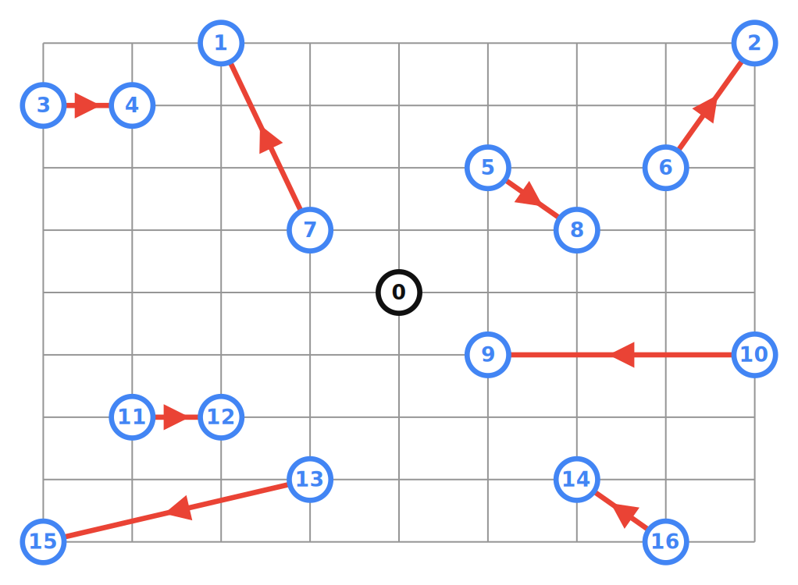
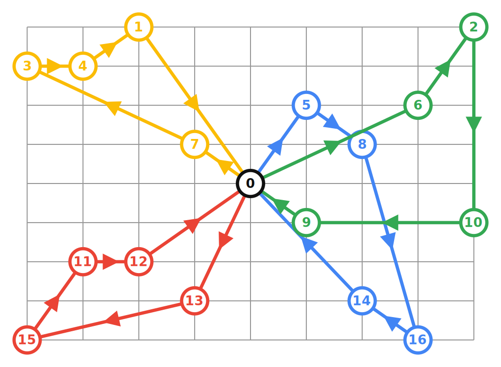
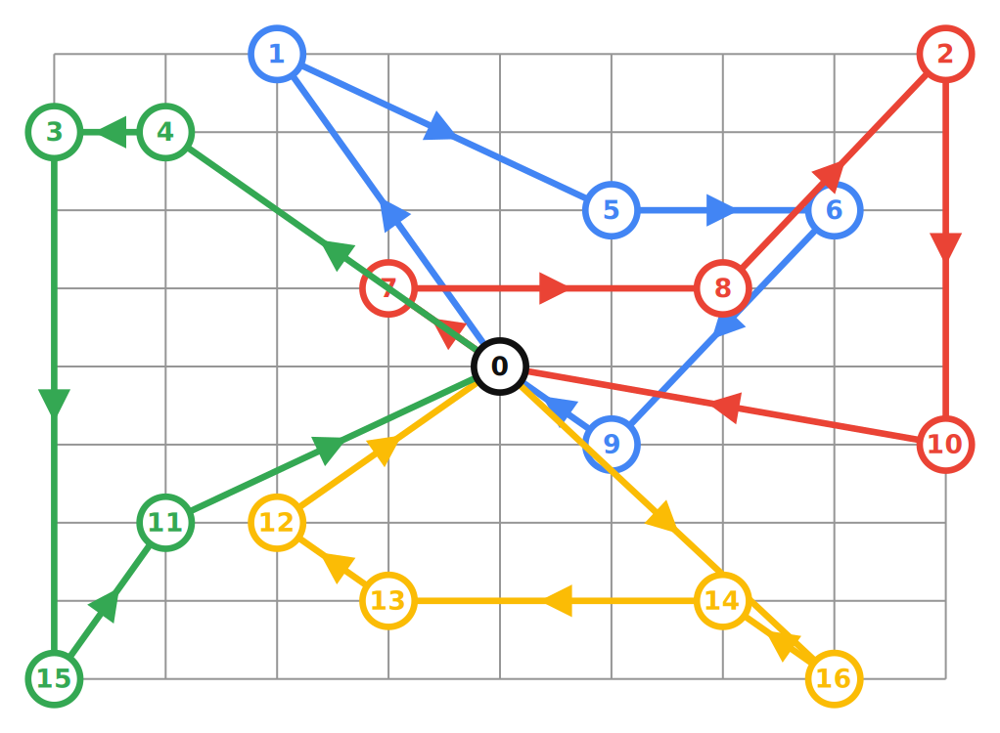
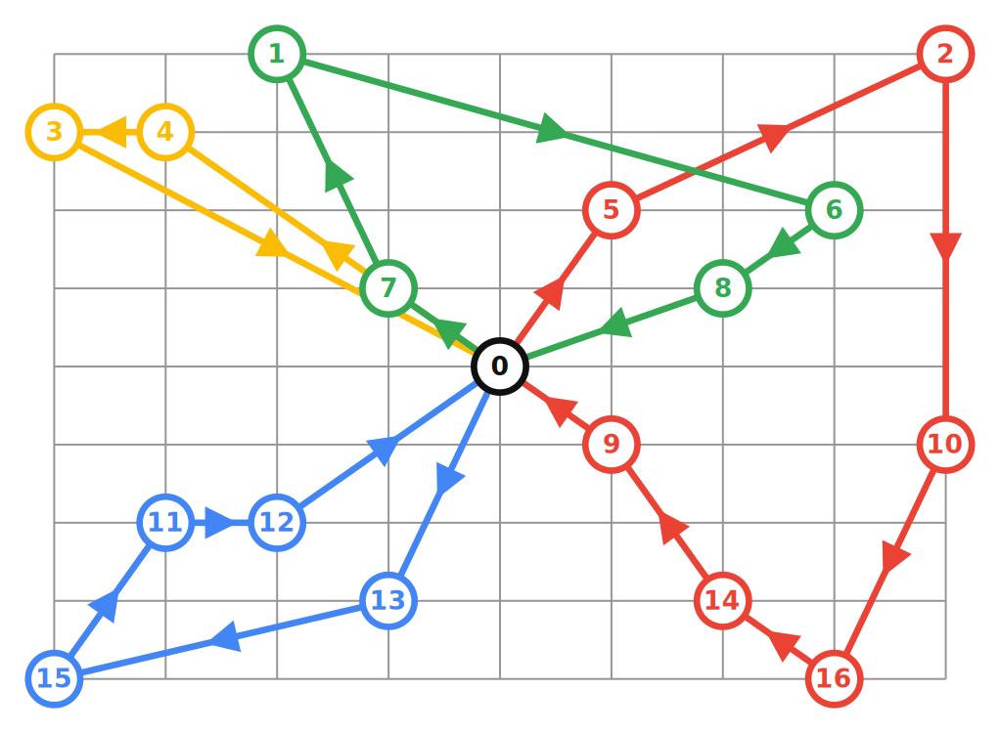

# Pickup & Delivery routing Problem recipes for the Vehicle Routing solver.

## Introduction

The Vehicle Routing solver can be used to solve various PDP.

## Pickup & Delivery Problem
Data Problem:

Solution with the default Policy (ANY):

Samples:

* [vrp_pickup_delivery.cc](../samples/vrp_pickup_delivery.cc)
* [vrp_pickup_delivery.py](../samples/vrp_pickup_delivery.py)
* [VrpPickupDelivery.java](../samples/VrpPickupDelivery.java)
* [VrpPickupDelivery.cs](../samples/VrpPickupDelivery.cs)

### FIFO Policy
Solution with the FIFO Policy:

Samples:

* [vrp_pickup_delivery_fifo.cc](../samples/vrp_pickup_delivery_fifo.cc)
* [vrp_pickup_delivery_fifo.py](../samples/vrp_pickup_delivery_fifo.py)
* [VrpPickupDeliveryFifo.java](../samples/VrpPickupDeliveryFifo.java)
* [VrpPickupDeliveryFifo.cs](../samples/VrpPickupDeliveryFifo.cs)

### LIFO Policy
Solution with the LIFO Policy:

Samples:

* [vrp_pickup_delivery_lifo.cc](../samples/vrp_pickup_delivery_lifo.cc)
* [vrp_pickup_delivery_lifo.py](../samples/vrp_pickup_delivery_lifo.py)
* [VrpPickupDeliveryLifo.java](../samples/VrpPickupDeliveryLifo.java)
* [VrpPickupDeliveryLifo.cs](../samples/VrpPickupDeliveryLifo.cs)
