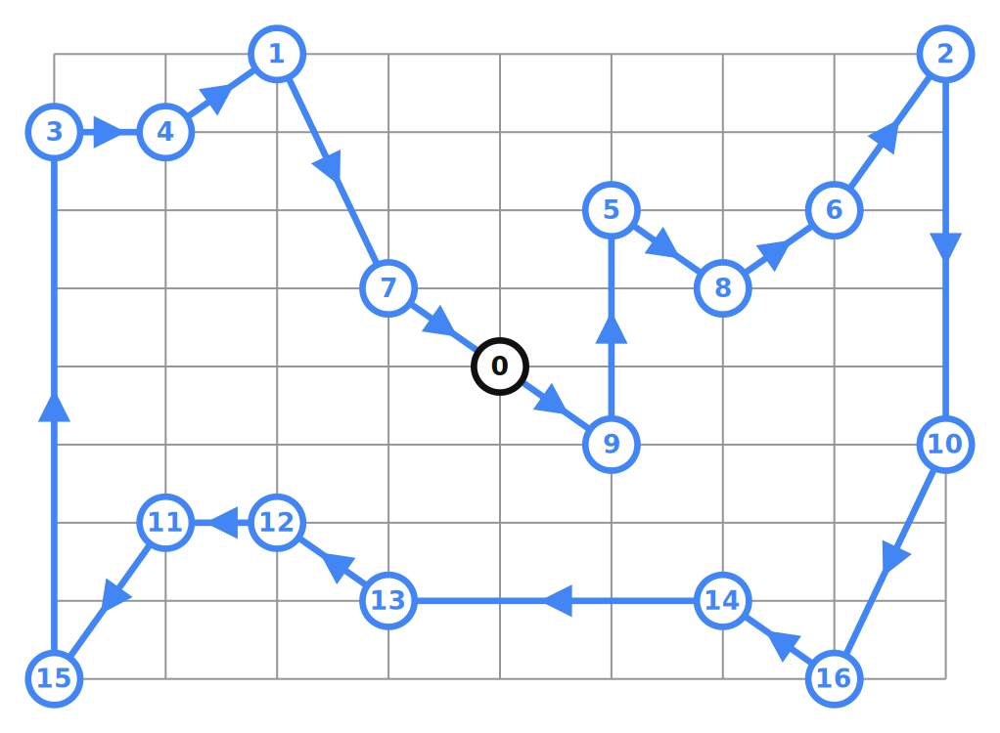
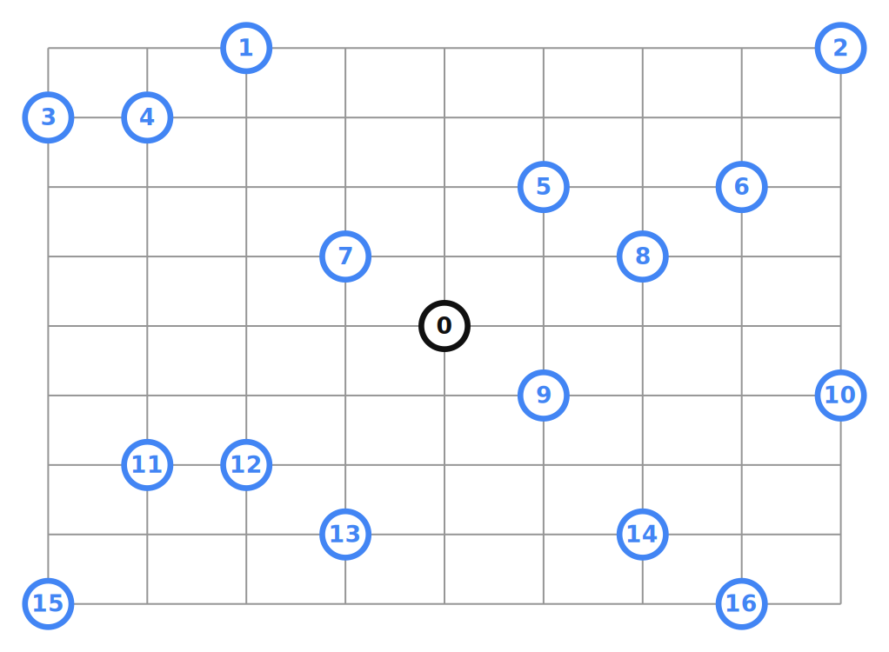

# Travelling Salesman Problem recipes for the Vehicle Routing solver.

## Introduction

The Vehicle Routing solver can be used to solve a Travelling Salesman Problem
(TSP).

## Using Locations
Data Problem:

Solution:

Samples:

* [tsp.cc](../samples/tsp.cc)
* [tsp.py](../samples/tsp.py)
* [Tsp.java](../samples/Tsp.java)
* [Tsp.cs](../samples/Tsp.cs)

## Using Distance Matrix
Data Problem:

Solution:

Samples:

* [tsp_distance_matrix.cc](../samples/tsp_distance_matrix.cc)
* [tsp_distance_matrix.py](../samples/tsp_distance_matrix.py)
* [TspDistanceMatrix.java](../samples/TspDistanceMatrix.java)
* [TspDistanceMatrix.cs](../samples/TspDistanceMatrix.cs)

