# Vehicle Routing Problem recipes for the Vehicle Routing solver.

## Introduction

The Vehicle Routing solver can be used to solve various VRP.

## Vehicle Routing Problem
Data Problem:

Solution:
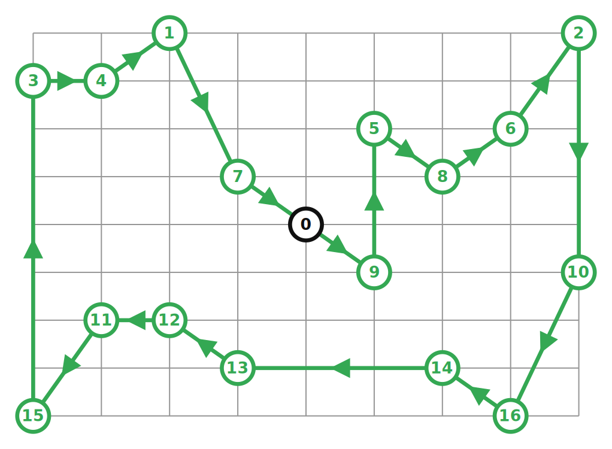

Samples:

* [vrp.cc](../samples/vrp.cc)
* [vrp.py](../samples/vrp.py)
* [Vrp.java](../samples/Vrp.java)
* [Vrp.cs](../samples/Vrp.cs)

## Global Span Constraints
Data Problem:
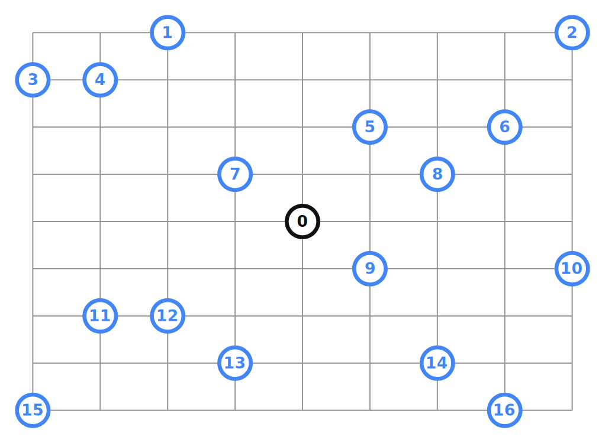

Solution:
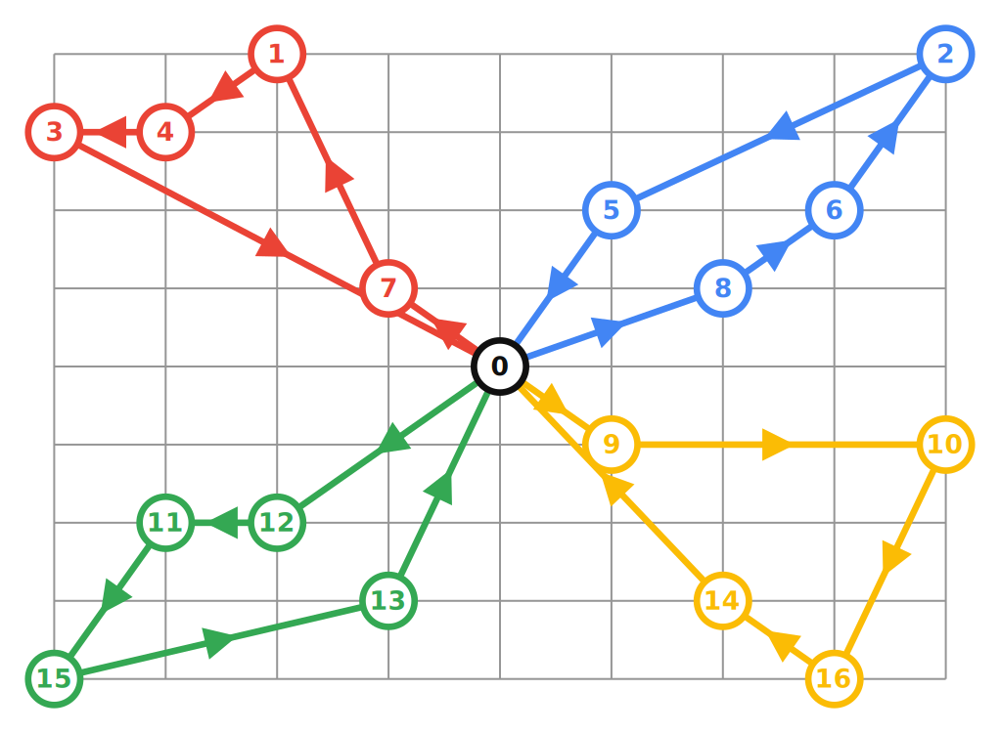

Samples:

* [vrp_global_span.cc](../samples/vrp_global_span.cc)
* [vrp_global_span.py](../samples/vrp_global_span.py)
* [VrpGlobalSpan.java](../samples/VrpGlobalSpan.java)
* [VrpGlobalSpan.cs](../samples/VrpGlobalSpan.cs)

## Capacity Constraints
Data Problem:
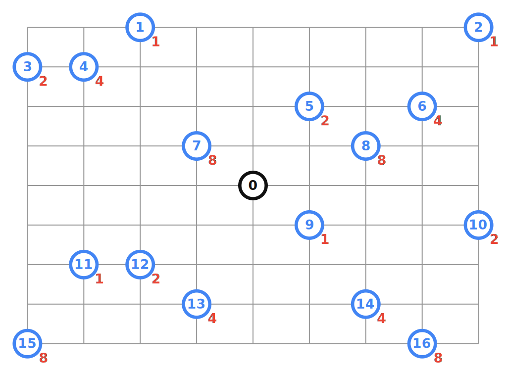

Solution:

Samples:

* [vrp_capacity.cc](../samples/vrp_capacity.cc)
* [vrp_capacity.py](../samples/vrp_capacity.py)
* [VrpCapacity.java](../samples/VrpCapacity.java)
* [VrpCapacity.cs](../samples/VrpCapacity.cs)

## Drop Nodes Constraints
Data Problem:
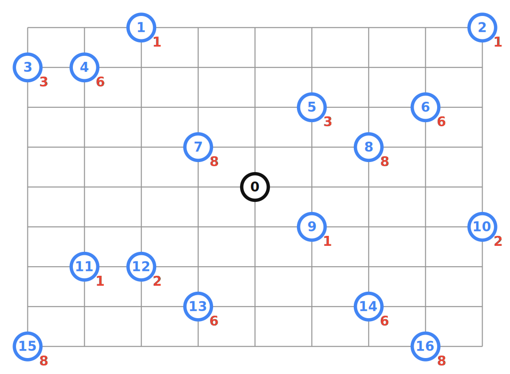

Solution:
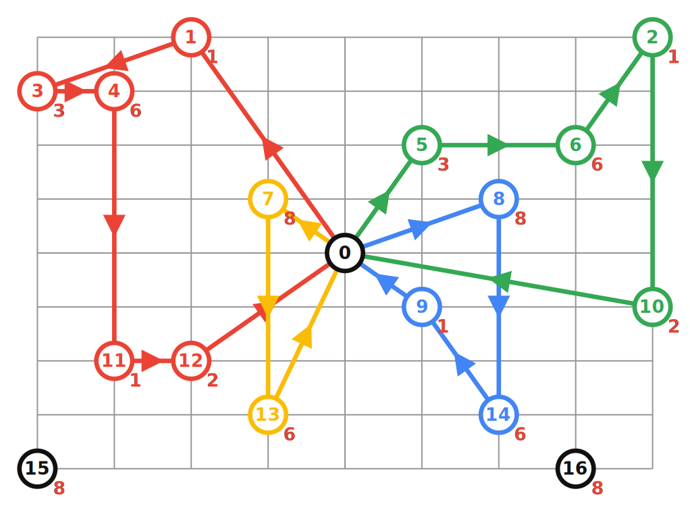

Samples:

* [vrp_drop_nodes.cc](../samples/vrp_drop_nodes.cc)
* [vrp_drop_nodes.py](../samples/vrp_drop_nodes.py)
* [VrpDropNodes.java](../samples/VrpDropNodes.java)
* [VrpDropNodes.cs](../samples/VrpDropNodes.cs)

## Multiple Starts Ends
Data Problem:
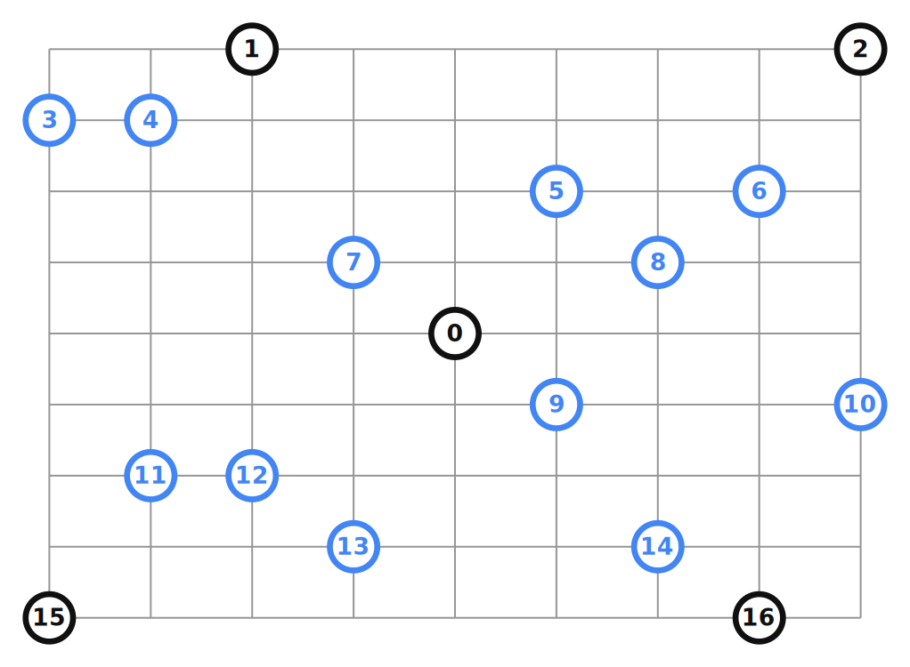

Solution:
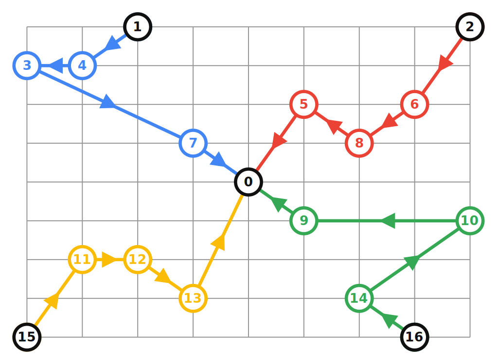

Samples:

* [vrp_starts_ends.cc](../samples/vrp_starts_ends.cc)
* [vrp_starts_ends.py](../samples/vrp_starts_ends.py)
* [VrpStartsEnds.java](../samples/VrpStartsEnds.java)
* [VrpStartsEnds.cs](../samples/VrpStartsEnds.cs)

## Time Window Constraints
Data Problem:

Solution:
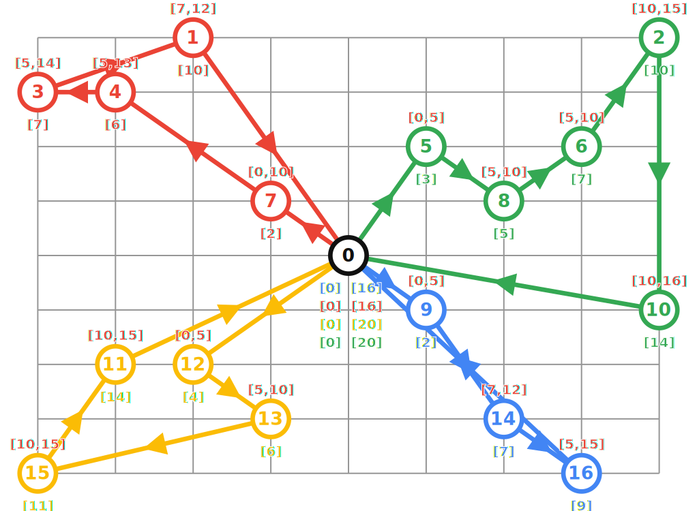

Samples:

* [vrp_time_windows.cc](../samples/vrp_time_windows.cc)
* [vrp_time_windows.py](../samples/vrp_time_windows.py)
* [VrpTimeWindows.java](../samples/VrpTimeWindows.java)
* [VrpTimeWindows.cs](../samples/VrpTimeWindows.cs)

## Resource Constraints
Data Problem:
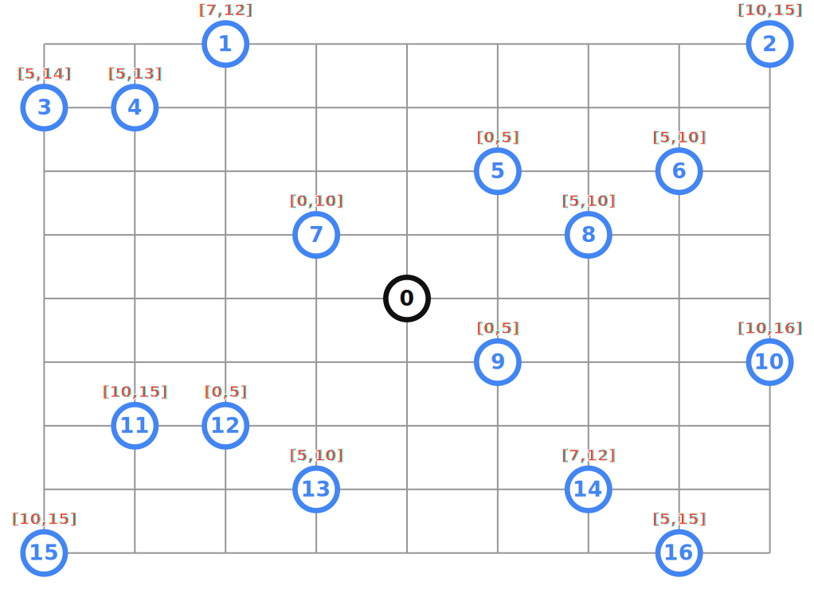

Solution:
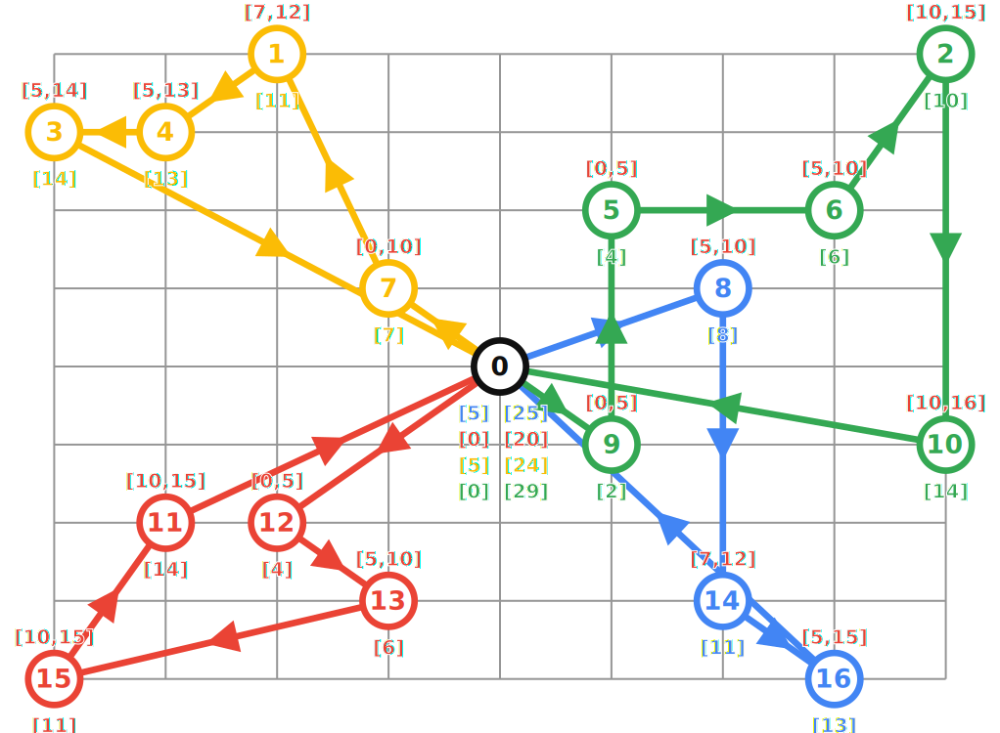

Samples:

* [vrp_resources.cc](../samples/vrp_resources.cc)
* [vrp_resources.py](../samples/vrp_resources.py)
* [VrpResources.java](../samples/VrpResources.java)
* [VrpResources.cs](../samples/VrpResources.cs)

