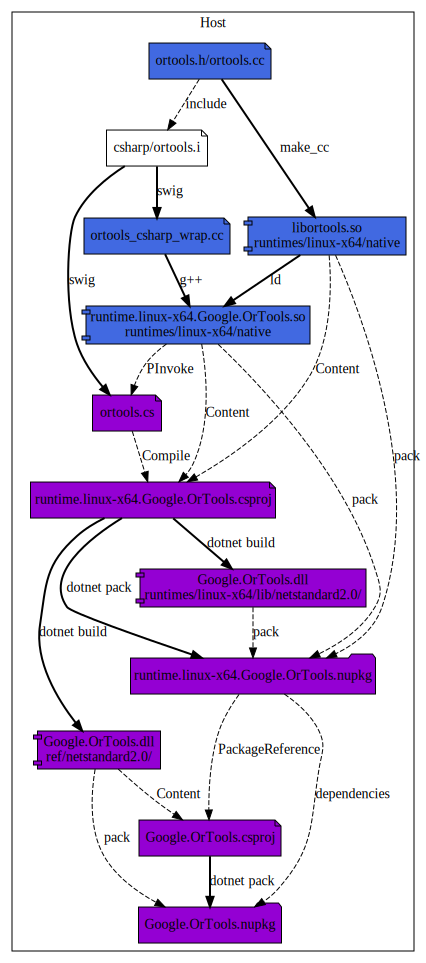
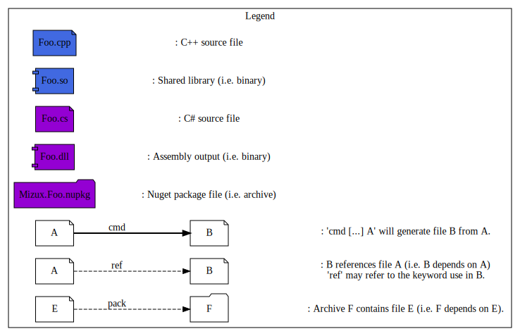
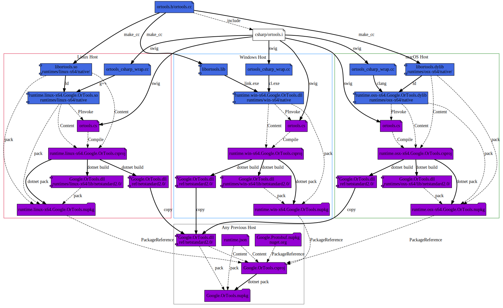

# Introduction

This is the documentation page for the .NET Standard 2.0 wrapper of OR-Tools.

This project aim to explain how you build a .Net native (for win-x64, linux-x64
and osx-x64) nuget package using `dotnet` and few `.csproj`.

## Table of Content

* [Requirement](#requirement)
* [Directory Layout](#directory-layout)
* [Build](#build)
  * [Build Process](#build-process)
  * [Local Google.OrTools Package](#local-googleortools-package)
    * [Building a runtime Google.OrTools Package](#building-local-runtime-googleortools-package)
    * [Building a Local Google.OrTools Package](#building-local-googleortools-package)
  * [Complete Google.OrTools Package](#complete-googleortools-package)
    * [Building all runtime Google.OrTools Package](#building-all-runtime-googleortools-package)
    * [Building a Complete Google.OrTools Package](#building-complete-googleortools-package)
* [Examples](#examples)
* [Appendices](#appendices)
  * [Resources](#resources)
  * [Issues](#issues)
* [Misc](#misc)

## Requirement

The library is compiled against `netstandard2.0`, so you'll only need:

* .Net Core SDK >= 3.1 LTS

## Directory Layout

* [`Google.OrTools.runtime.linux-x64`](Google.OrTools.runtime.linux-x64)
Contains the .Net Standard 2.0 native project for the rid linux-x64.
* [`Google.OrTools.runtime.osx-x64`](Google.OrTools.runtime.osx-x64)
Contains the .Net Standard 2.0 native project for the rid osx-x64.
* [`Google.OrTools.runtime.win-x64`](Google.OrTools.runtime.win-x64)
Contains the .Net Standard 2.0 native project for the rid win-x64.
* [`Google.OrTools`](Google.OrTools) Is the .Net Standard 2.0 meta-package which
should depends on all previous available packages and contains the Reference
Assembly.

note: While Microsoft use `runtime-<rid>.Company.Project` for native libraries
naming, it is very difficult to get ownership on it, so you should prefer to use
`Company.Project.runtime-<rid>` instead since you can have ownership on
`Company.*` prefix more easily.

## Build

Either use the CMake base build or the Makefile based build. The workflow is
typically `make dotnet` which will build both C# and F# libraries package. The
output will be placed in `<OR_ROOT>/temp_dotnet/packages` folder. All tests will
be run based on this folder.

### Build Process

To Create a native dependent package we will split it in two parts: - A bunch of
`Google.OrTools.runtime.{rid}.nupkg` packages for each
[Runtime Identifier (RId)](https://docs.microsoft.com/en-us/dotnet/core/rid-catalog)
targeted. - A meta-package `Google.OrTools.nupkg` depending on each runtime
packages.

note: [`Microsoft.NetCore.App` packages](https://www.nuget.org/packages?q=Microsoft.NETCore.App)
follow this layout.

We have two use case scenario:

1.  Locally, be able to build a Google.OrTools package which **only** target the
    local `OS Platform`, i.e. building for only one
    [Runtime Identifier (RID)](https://docs.microsoft.com/en-us/dotnet/core/rid-catalog).
    \
    note: This is useful since the C++ build is a complex process for Windows,
    Linux and MacOS. i.e. We don't support cross-compilation for the native
    library generation.

2.  Be able to create a complete cross-platform (ed. platform as multiple rid)
    Google.OrTools package. \
    i.e. First you generate each native Nuget package
    (`Google.OrTools.runtime.{rid}.nupkg`) on each native architecture, then
    copy paste these artifacts on one native machine to generate the
    meta-package `Google.OrTools`.

### Local Google.OrTools Package

Let's start with scenario 1: Create a *Local* `Google.OrTools` package targeting **one**
[Runtime Identifier (RID)](https://docs.microsoft.com/en-us/dotnet/core/rid-catalog).
<br>We would like to build a `Google.OrTools.nupkg` package which only depends
on one `Google.OrTools.runtime.{rid}.nupkg` in order to work locally.

The pipeline for `linux-x64` should be as follow:


note: The pipeline will be similar for `osx-x64` and `win-x64` architecture,
don't hesitate to look at the CI log.

#### Building local runtime Google.OrTools Package

disclaimer: We won't cover the C++ ortools library build. So first let's create
the local `Google.OrTools.runtime.{rid}.nupkg` nuget package.

Here some dev-note concerning this `Google.OrTools.runtime.{rid}.csproj`.
* `AssemblyName` must be `Google.OrTools.dll` i.e. all {rid} projects **must**
  generate an assembly with the **same** name (i.e. no {rid} in the name).
  On the other hand package identifier will contain the {rid}...
  ```xml
  <RuntimeIdentifier>{rid}</RuntimeIdentifier>
  <AssemblyName>Google.OrTools</AssemblyName>
  <PackageId>Google.OrTools.runtime.{rid}</PackageId>
  ```
* Once you specify a `RuntimeIdentifier` then `dotnet build` or `dotnet build -r {rid}`
  will behave identically (save you from typing it).
  note: not the case if you use `RuntimeIdentifiers` (notice the 's')
* It is [recommended](https://docs.microsoft.com/en-us/nuget/create-packages/native-packages)
  to add the tag `native` to the
  [nuget package tags](https://docs.microsoft.com/en-us/dotnet/core/tools/csproj#packagetags)
  ```xml
  <PackageTags>native</PackageTags>
  ```
* Specify the output target folder for having the assembly output in
  `runtimes/{rid}/lib/netstandard2.0` in the nupkg
  ```xml
  <BuildOutputTargetFolder>runtimes/$(RuntimeIdentifier)/lib</BuildOutputTargetFolder>
  ```
  note: Every files with an extension different from `.dll` will be filter out
  by nuget. \
  note: dotnet/cli automatically add the `$(TargetFramework)` (i.e.
  `netstandard2.0`) to the output path.
* Add the native shared library to the nuget package in the repository
  `runtimes/{rib}/native`. e.g. for linux-x64:
  ```xml
  <Content Include="*.so">
    <PackagePath>runtimes/linux-x64/native/%(Filename)%(Extension)</PackagePath>
    <Pack>true</Pack>
    <CopyToOutputDirectory>PreserveNewest</CopyToOutputDirectory>
  </Content>
  ```
* Generate the runtime package to a defined directory (i.e. so later in meta
  Google.OrTools package we will be able to locate it)
  ```xml
  <PackageOutputPath>{...}/packages</PackageOutputPath>
  ```
* Generate the Reference Assembly (but don't include it to this runtime nupkg !,
  see below for explanation) using:
  ```xml
  <ProduceReferenceAssembly>true</ProduceReferenceAssembly>
  ```

Then you can generate the package using:
```bash
dotnet pack src/Google.OrTools.runtime.{rid}
```
note: this will automatically trigger the `dotnet build`.

If everything good the package (located where your `PackageOutputPath` was
defined) should have this layout:
```
{...}/packages/Google.OrTools.runtime.{rid}.nupkg:
\- Google.OrTools.runtime.{rid}.nuspec
\- runtimes
   \- {rid}
      \- lib
         \- {framework}
            \- Google.OrTools.dll
      \- native
         \- *.so / *.dylib / *.dll
...
```
note: `{rid}` could be `linux-x64` and `{framework}` could be `netstandard2.0`

tips: since nuget package are zip archive you can use `unzip -l <package>.nupkg`
to study their layout.

#### Building local Google.OrTools Package

So now, let's create the local `Google.OrTools.nupkg` nuget package which will
depend on our previous runtime package.

Here some dev-note concerning this `Google.OrTools.csproj`.

* This package is a meta-package so we don't want to ship an empty assembly file
  : `xml <IncludeBuildOutput>false</IncludeBuildOutput>`
* Add the previous package directory: `xml <RestoreSources>{...}/packages;
  $(RestoreSources)</RestoreSources>`
* Add dependency (i.e. `PackageReference`) on each runtime package(s) available:
  `xml <ItemGroup Condition="Exists('{...}/packages/Google.OrTools.runtime.linux-x64.1.0.0.nupkg')">
  <PackageReference Include="Google.OrTools.runtime.linux-x64" Version="1.0.0" />
  </ItemGroup>` Thanks to the `RestoreSource` we can work locally with our just
  builded package without the need to upload it on
  [nuget.org](https://www.nuget.org/).
* To expose the .Net Surface API the `Google.OrTools.csproj` must contains at
  least one
  [Reference Assembly](https://docs.microsoft.com/en-us/nuget/reference/nuspec#explicit-assembly-references)
  of the previously rumtime package. `xml <Content
  Include="../Google.OrTools.runtime.{rid}/bin/$(Configuration)/$(TargetFramework)/{rid}/ref/*.dll">
  <PackagePath>ref/$(TargetFramework)/%(Filename)%(Extension)</PackagePath>
  <Pack>true</Pack> <CopyToOutputDirectory>PreserveNewest</CopyToOutputDirectory>
  </Content>`

Then you can generate the package using:
```bash
dotnet pack src/Google.OrTools
```

If everything good the package (located where your `PackageOutputPath` was
defined) should have this layout: `{...}/packages/Google.OrTools.nupkg: \-
Google.OrTools.nuspec \- ref \- {framework} \- Google.OrTools.dll ...` note:
`{framework}` could be `netstandard2.0`

### Complete Google.OrTools Package

Let's start with scenario 2: Create a *Complete* `Google.OrTools.nupkg` package
targeting multiple
[Runtime Identifier (RID)](https://docs.microsoft.com/en-us/dotnet/core/rid-catalog).
<br>We would like to build a `Google.OrTools.nupkg` package which depends on several
`Google.OrTools.runtime.{rid}.nupkg`.

The pipeline should be as follow: \
note: This pipeline should be run on any architecture, provided you have
generated the three architecture dependent `Google.OrTools.runtime.{rid}.nupkg`
nuget packages. 


#### Building All runtime Google.OrTools Package

Like in the previous scenario, on each targeted OS Platform you can build the
corresponding `Google.OrTools.runtime.{rid}.nupkg` package.

Simply run on each platform `bash dotnet build src/Google.OrTools.runtime.{rid}
dotnet pack src/Google.OrTools.runtime.{rid}` note: replace `{rid}` by the
Runtime Identifier associated to the current OS platform.

Then on one machine used, you copy all other packages in the `{...}/packages` so
when building `Google.OrTools.csproj` we can have access to all package...

#### Building Complete Google.OrTools Package

This is the same step than in the previous scenario, since we "see" all runtime
packages in `{...}/packages`, the project will depends on each of them.

Once copied all runtime package locally, simply run:
```bash
dotnet build src/Google.OrTools
dotnet pack src/Google.OrTools
```

## Examples

The Test projects show examples of building applications with `netcoreapp3.1`.

The F# example folder shows how to compile against the typical .NET Framework
installed on machine.

## Appendices

Few links on the subject...

.Net runtime can deduce library extension so don’t use a platform-specific
library name in the `DllImport` statement.
Instead, just use the library name itself, without any prefixes or suffixes,
and rely on the runtime to find the appropriate library at runtime.\
ref: [Mono `pinvoke#libraryname`](https://www.mono-project.com/docs/advanced/pinvoke/#library-names)

## Resources

Some issue related to this process
* [`PackageReference` only support `TargetFramework` condition](https://docs.microsoft.com/en-us/nuget/consume-packages/package-references-in-project-files#adding-a-packagereference-condition)
* [Nuget needs to support dependencies specific to target runtime #1660](https://github.com/NuGet/Home/issues/1660)
* [Improve documentation on creating native packages #238](https://github.com/NuGet/docs.microsoft.com-nuget/issues/238)

### Runtime IDentifier (RID)

* [.NET Core RID Catalog](https://docs.microsoft.com/en-us/dotnet/core/rid-catalog)
* [Creating native packages](https://docs.microsoft.com/en-us/nuget/create-packages/native-packages)
* [Blog on Nuget Rid Graph](https://natemcmaster.com/blog/2016/05/19/nuget3-rid-graph/)

### Target Framework Moniker (TFM)

* [.NET TFM list](https://docs.microsoft.com/en-us/dotnet/standard/frameworks)
* [.NET Standard implementation support](https://docs.microsoft.com/en-us/dotnet/standard/net-standard)


### Reference on .csproj format

* [Common MSBuild project properties](https://docs.microsoft.com/en-us/visualstudio/msbuild/common-msbuild-project-properties?view=vs-2017)
* [MSBuild well-known item metadata](https://docs.microsoft.com/en-us/visualstudio/msbuild/msbuild-well-known-item-metadata?view=vs-2017)
* [Additions to the csproj format for .NET Core](https://docs.microsoft.com/en-us/dotnet/core/tools/csproj)

## Misc

Image has been generated using [plantuml](http://plantuml.com/):
```bash
plantuml -Tpng doc/{file}.dot
```

So you can find the dot source files in [doc](doc).
