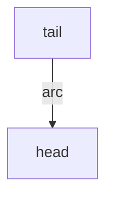
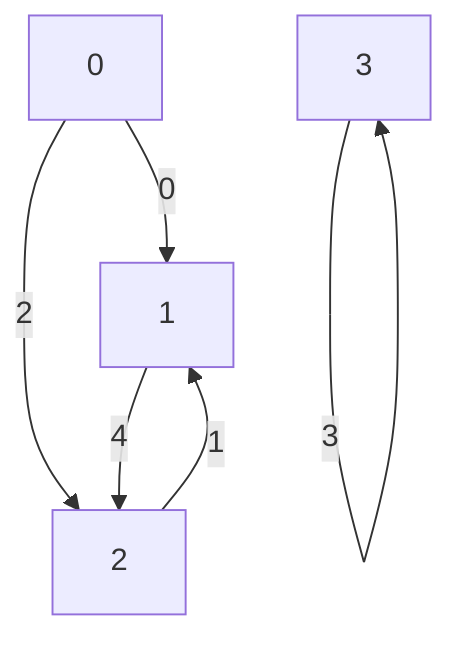
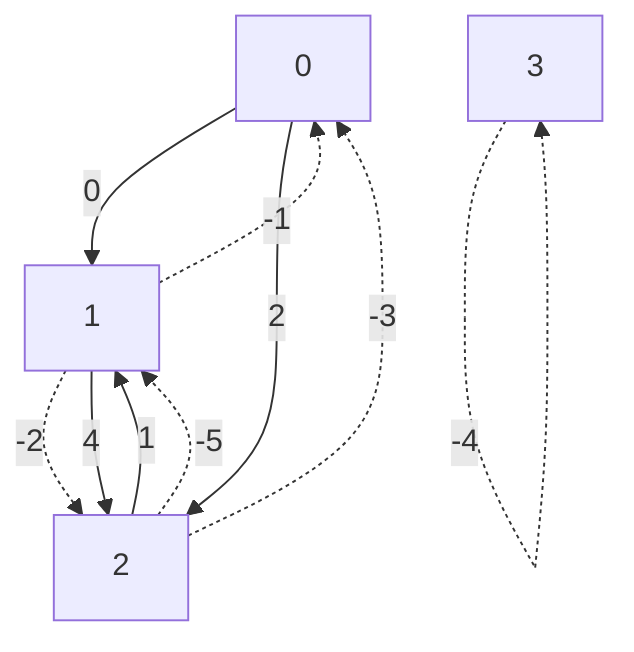

# Graph and Network Flows

This directory contains data structures and algorithms for graph and network
flow problems.

It contains in particular:

* well-tuned algorithms (for example, shortest paths and
  [Hamiltonian paths](https://en.wikipedia.org/wiki/Hamiltonian_path)).
* hard-to-find algorithms (Hamiltonian paths, push-relabel flow algorithms).
* other, more common algorithms, that are useful to use with graphs from
  `util/graph`.

Generic algorithms for shortest paths:

* [`bounded_dijkstra.h`][bounded_dijkstra_h]: entry point for shortest paths.
  This is the preferred implementation for most needs.
* [`bidirectional_dijkstra.h`][bidirectional_dijkstra_h]: for large graphs,
  this implementation might be faster than `bounded_dijkstra.h`.
* [`shortest_paths.h`][shortest_paths_h]: shortest paths that are computed in
  parallel (only if there are several sources). Includes
  [Dijkstra](https://en.wikipedia.org/wiki/Dijkstra%27s_algorithm) and
  [Bellman-Ford](https://en.wikipedia.org/wiki/Bellman%E2%80%93Ford_algorithm)
  algorithms. *Although its name is very generic, only use this implementation
  if parallelism makes sense.*

Specific algorithms for paths:

* [`dag_shortest_path.h`][dag_shortest_path_h]: shortest paths on directed
  acyclic graphs. If you have such a graph, this implementation is likely to be
  the fastest. Unlike most implementations, these algorithms have two interfaces
  : a "simple" one (list of edges and weights) and a standard one (taking as
  input a graph data structure from [`//ortools/graph_base/graph.h`][graph_h]).
* [`dag_constrained_shortest_path.`][dag_constrained_shortest_path_h]: shortest
  paths on directed acyclic graphs with resource constraints.
* [`hamiltonian_path.h`][hamiltonian_path_h]: entry point for computing minimum
  [Hamiltonian paths](https://en.wikipedia.org/wiki/Hamiltonian_path) and cycles
  on directed graphs with costs on arcs, using a dynamic-programming algorithm.
* [`eulerian_path.h`][eulerian_path_h]: entry point for computing minimum
  [Eulerian paths](https://en.wikipedia.org/wiki/Eulerian_path) and cycles on
  undirected graphs.

Graph decompositions:

* [`connected_components.h`][connected_components_h]: entry point for computing
  connected components in an undirected graph. (It does not need an explicit
  graph class.)
* [`strongly_connected_components.h`][strongly_connected_components_h]: entry
  point for computing the strongly connected components of a directed graph.
* [`cliques.h`][cliques_h]: entry point for computing maximum cliques and clique
  covers in a directed graph, based on the Bron-Kerbosch algorithm.(It does not
  need an explicit graph class.)

Flow algorithms:

* [`linear_assignment.h`][linear_assignment_h]: entry point for solving linear
  sum assignment problems (classical assignment problems where the total cost is
  the sum of the costs of each arc used) on directed graphs with arc costs,
  based on the Goldberg-Kennedy push-relabel algorithm.
* [`max_flow.h`][max_flow_h]: entry point for computing maximum flows on
  directed graphs with arc capacities, based on the Goldberg-Tarjan push-relabel
  algorithm.
* [`min_cost_flow.h`][min_cost_flow_h]: entry point for computing minimum-cost
  flows on directed graphs with arc capacities, arc costs, and supplies/demands
  at nodes, based on the Goldberg-Tarjan push-relabel algorithm.

## Class design

`BaseGraph` is a generic graph interface on which most algorithms can be built
and provides efficient implementations with a fast construction time. Its design
is based on the experience acquired in various graph algorithm implementations.

The main ideas are:

-   Graph nodes and arcs are represented by integers.

-   Node or arc annotations (weight, cost, ...) are not part of the graph class,
    they can be stored outside in one or more arrays and can be easily retrieved
    using a node or arc as an index.

### Terminology

An *arc* (or *forward arc*) of a graph is directed and going from a *tail node*
to a *head node*.

Node and arc indices are of type `NodeIndexType` and `ArcIndexType`
respectively. Those default to `int32_t`, which allows representing most
practical graphs, but applications that have smaller graphs can improve memory
usage and locality by parameterizing the graph type (e.g. `BaseGraph<int16_t,
int16_t>` allows representing graphs with up to 65k nodes and arcs).

A node or arc index is *valid* if it represents a node or arc of the graph. The
validity ranges are always `[0, num_nodes())` for nodes and `[0, num_arcs())`
for forward arcs. For example, the following graph has 4 nodes numbered 0
through 3 and 5 forward arcs numbered 0 through 4:

Some graph implementations also store *reverse arcs* and can be used for
undirected graphs or flow-like algorithms. Reverse arcs are elements of
`[-num_arcs(), 0)` and are also considered valid by the implementations that
store them. In the following diagram, reverse arcs are represented with dashed
lines. A reverse arc is created for each forward arc (the forward and
reverse arc in this pair are called *opposite* of each other). This possibly
results in multiarcs:

#### Graph traversal

-   The *outgoing arcs* of a node `v` are the forward arcs whose tail is `v`.
-   The *incoming arcs* of `v` are the forward arcs whose head is `v`.
-   The *opposite incoming* arcs of `v` are the opposite arcs of the incoming
    arcs for `v`.

Forward graph classes allow iteration on outgoing arcs using accessor
`OutgoingArcs()`. Graph classes with both forward and reverse arcs additionally
provide `IncomingArcs` and `OppositeIncomingArcs()`, that return iterators for
the two other categories. They also provide `OutgoingOrOppositeIncomingArcs()`,
which allows iterating both outgoing and opposite incoming arcs at the same
time, which corresponds to iterating forward and reverse arcs *leaving* the
node.

`v` | `OutgoingArcs(v)` | `IncomingArcs(v)` | `OppositeIncomingArcs(v)` | `OutgoingOrOppositeIncoming(v)`
--- | ----------------- | ----------------- | ------------------------- | -------------------------------
0   | {0,2}             | {}                | {}                        | {0,2}
1   | {4}               | {0,1}             | {-2,-1}                   | {-2,-1,4}
2   | {1}               | {2,4}             | {-5,-3}                   | {-5,-3,1}
3   | {3}               | {3}               | {-4}                      | {-4,3}

### Graph implementations

-   `ListGraph<>`: Simplest API. Iterating outgoing arcs requires `2 + degree`
    memory loads.

-   `StaticGraph<>`: More memory and speed efficient than `ListGraph<>`, but
    requires calling `Build()` once after adding all nodes and arcs. Iterating
    outgoing arcs requires only `2` memory loads.

-   `ReverseArcListGraph<>` adds reverse arcs to `ListGraph<>`. Iterating
    neighboring arcs for a node requires `O(degree)` memory loads.

-   `ReverseArcStaticGraph<>` adds reverse arcs to `StaticGraph<>`. Iterating
    neighboring arcs for a node requires `O(1)` memory loads.

-   `CompleteGraph<>`: If you need a fully connected graph. O(1) memory usage
    and much faster than explicitly storing nodes and arcs using
    `StaticGraph<>`.

-   `CompleteBipartiteGraph<>`: If you need a fully connected bipartite graph.
    O(1) memory usage and much faster than explicitly storing nodes and arcs
    using `StaticGraph<>`.

-   `FlowGraph<>`: A graph specialized for max-flow/min-cost-flow algorithms.
    For max-flow or min-cost-flow we need a directed graph where each arc from
    tail to head has a reverse arc from head to tail. In practice many input
    graphs already have such reverse arc and it can make a big difference just
    to reuse them. This is similar to `ReverseArcStaticGraph` but handles
    reverse arcs in a different way. Instead of always creating a *new* reverse
    arc for each arc of the input graph, this detects if a reverse arc is
    already present in the input, and does not create a new one when this is the
    case. In the best case, this can gain a factor 2 in the final graph size,
    note however that the graph construction is slightly slower because of this
    detection.

## Wrappers

* [`python`](python): This directory contains the `pybind11` bindings to make
  these C++ libraries available in Python.
* [`java`](java): the SWIG code that makes the wrapper available in Java and its
  unit tests.
* [`csharp`](csharp): the SWIG code that makes the wrapper available in C# and
  its unit tests.

## Samples

You can find some canonical examples in [`samples`][samples].

<!-- Links used throughout the document. -->
[graph_h]: ../graph/graph.h
[bounded_dijkstra_h]: ../graph/bounded_dijkstra.h
[bidirectional_dijkstra_h]: ../graph/bidirectional_dijkstra.h
[shortest_paths_h]: ../graph/shortest_paths.h
[dag_shortest_path_h]: ../graph/dag_shortest_path.h
[dag_constrained_shortest_path_h]: ../graph/dag_constrained_shortest_path.h
[hamiltonian_path_h]: ../graph/hamiltonian_path.h
[eulerian_path_h]: ../graph/eulerian_path.h
[connected_components_h]: ../graph/connected_components.h
[strongly_connected_components_h]: ../graph/strongly_connected_components.h
[cliques_h]: ../graph/cliques.h
[linear_assignment_h]: ../graph/linear_assignment.h
[max_flow_h]: ../graph/max_flow.h
[min_cost_flow_h]: ../graph/min_cost_flow.h
[samples]: ../graph/samples/
[graph]: ../graph/
