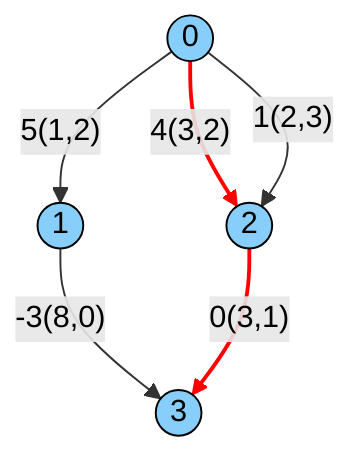
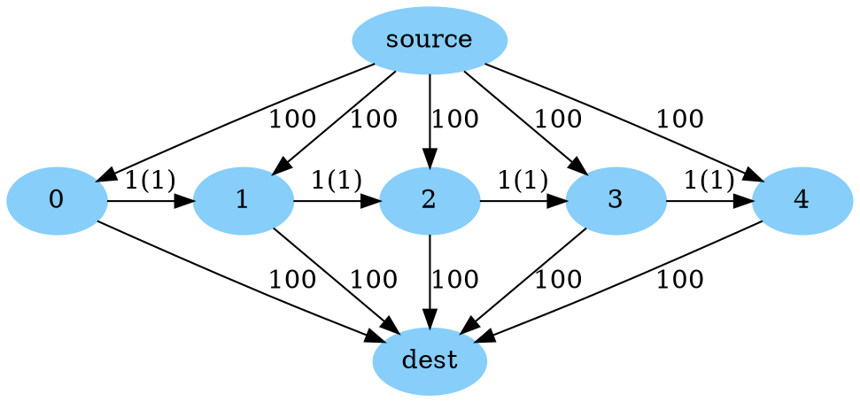

# Constrained shortest (or longest) path for Directed Acyclic Graphs (DAGs)

[TOC]

**Directed** graphs without cycles are commonly called DAGs (**D**irected
**A**cyclic **G**raphs). We can solve shortest path problems on these graphs
using [dynamic programming](shortest_path_dag.md).

We now define the resource-constrained shortest path problem formally. The input
has the problem data:

*   $$G = (V, A)$$ a directed graph that we are finding the path in.
*   $$s \in V$$ the starting node of the path.
*   $$t \in V$$ the terminal node of the path.
*   $$c_a$$ the floating point cost taking arc $$a \in A$$ in the path.
*   $$R$$ the set of resources the path is constrained on.
*   $$u_{ar} \geqslant 0$$ the non-negative floating point resource use of arc
    $$a \in A$$ for resource $$r \in R$$.
*   $$L_r$$ the resource limit for resource $$r \in R$$.

The problem is to pick a path $$P \subset A$$ from $$s$$ to $$t$$ that minimizes
$$\sum_{a \in P} c_a$$, subject to $$\sum_{a \in P} u_{ar} \leqslant L_r$$ for
each resource $$r \in R$$. Note that resources have to be cumulative.

We can equivalently write down a mathematical optimization problem. For $$n \in
N$$, let $$A^{+}_n$$ and $$A^{-}_n$$ be respectively the outgoing and incoming
arcs at node $$n$$.

Decision variables:

*   $$x_a \in \{0, 1\}$$ equal to 1 if we take arc $$a \in A$$.

Formulation:

$$
\begin{array}{l}
\displaystyle \min_{x} \left\{ \sum_{a \in A} c_a x_a \right\}
\end{array}
$$

subject to

$$
\begin{array}{l}
\displaystyle \sum_{a \in A} u_{ar} x_a \leqslant L_r & \forall r \in R
\\
\displaystyle \sum_{a \in A^{-}(n)} x_a - \sum_{a \in A^{+}(n)} x_a =
\left\{
\begin{array}{ll}
-1 && \text{if } n = s
\\
1 && \text{if } n = t
\\
0 && \text{otherwise }
\end{array}
\right. & \forall n \in N
\\
x_a \in \{0, 1\} & \forall a \in A
\end{array}
$$

By negating our objective, we can solve constrained longest path problems as
well!

This problem can be solved using MIP, but it is generally not the most efficient
way to do so. The solution presented below uses a combination of techniques
presented in
[Lozano and Medaglia (2013)](https://www.sciencedirect.com/science/article/pii/S0305054812001530)
and [Zeng and Zhao (2018)](https://ieeexplore.ieee.org/document/8780618)
including bidirectional search, label dominance, and dual pruning. The algorithm
is exponential and has no guarantee to finish with a limited number of labels.
This problem does not have a canonical solution, there are many possible ways to
solve it with different tradeoffs. With the caveat that the running time is very
sensitive to problem data, we expect that this algorithm runs in a few seconds
for graphs with millions of nodes and fewer than 10 resources.

## Constrained shortest path in a DAG

Below, we give an example showing how to solve a constrained shortest path
problem on a DAG. This example can be found at
[`dag_simple_constrained_shortest_path.cc`](../samples/dag_simple_constrained_shortest_path.cc).

In this problem, our goal is to find the shortest path from 0 to 3 (shown in
bold red in the image) and its total length while making sure that the
cumulative resource does not exceed each resource limit. There are two resource
constraints to consider (in practice these could be time and fuel for instance).
The first resource limit is $$L_1 = 6$$ and the second $$L_2=3$$. In the image
below, each arc is labeled `X(Y,Z)`, where X is the cost of the arc and Y and Z
are the first and second resource use of the arc.



The constrained shortest path is shown in red in the image. It has a cost of 4,
and uses $$6 \leqslant L_1$$ of the first resource and $$3 \leqslant L_2$$ of
the second resource.

We solve this using `ConstrainedShortestPathsOnDag()` from
[`dag_constrained_shortest_path.h`](../dag_constrained_shortest_path.h)
below:

```cpp
// Snippet from ortools/graph/samples/dag_simple_constrained_shortest_path.cc
#include <iostream>
#include <vector>

#include "ortools/base/init_google.h"
#include "absl/strings/str_join.h"
#include "ortools/graph/dag_constrained_shortest_path.h"
#include "ortools/graph/dag_shortest_path.h"

int main(int argc, char** argv) {
  InitGoogle(argv[0], &argc, &argv, true);

  // The input graph, encoded as a list of arcs with distances.
  std::vector<operations_research::ArcWithLengthAndResources> arcs = {
      {.from = 0, .to = 1, .length = 5, .resources = {1, 2}},
      {.from = 0, .to = 2, .length = 4, .resources = {3, 2}},
      {.from = 0, .to = 2, .length = 1, .resources = {2, 3}},
      {.from = 1, .to = 3, .length = -3, .resources = {8, 0}},
      {.from = 2, .to = 3, .length = 0, .resources = {3, 1}}};
  const int num_nodes = 4;
  const std::vector<double> max_resources = {6, 3};

  const int source = 0;
  const int destination = 3;
  const operations_research::PathWithLength path_with_length =
      operations_research::ConstrainedShortestPathsOnDag(
          num_nodes, arcs, source, destination, max_resources);

  // Print to length of the path and then the nodes in the path.
  std::cout << "Constrained shortest path length: " << path_with_length.length
            << std::endl;
  std::cout << "Constrained shortest path nodes: "
            << absl::StrJoin(path_with_length.node_path, ", ") << std::endl;
  return 0;
}
```

Running this code generates the output:

```text
Shortest path length: 4
Shortest path nodes: 0, 2, 3
```

## Sequential computations

When we need to solve many constrained shortest path problems on the same DAG
sequentially, possibly with the arc costs changing between solves but *no
constraints have changed*, we can do better than just calling
`ConstrainedShortestPathsOnDag()` in a loop. By using the class
`ConstrainedShortestPathsOnDagWrapper` (also defined in
`dag_constrained_shortest_path.h`), we can reuse some of the computation between
each run. Below, we give an example of how to do this.

The code for this example can be found at
[`dag_constrained_shortest_path_sequential.cc`](../samples/dag_constrained_shortest_path_sequential.cc).

We have the following DAG:



The (only) topological order for this graph is `source`, `0`, `1`, `2`, `3`,
`4`, `dest`.

We let $$M = \{0, 1, \ldots, 4\}$$ be the set of nodes in the middle.

In this problem, there is a single resource constraint with limit $$L_1 = 1$$.
All arcs starting from `source` or going to `dest` do not use any resource. For
each arc between $$i \in M$$ and $$i + 1 \in M$$, the arc has a resource use of
1. This constraint implies that a feasible path can only pass through one or two
nodes in $$M$$.

With the initial distances, all constrained shortest paths from `source` to
`dest` pass through a single node in $$M$$ and have total cost 200 and a
resource use of 0.

We want to solve a sequence of constrained shortest path problems, where in each
round, we pick nodes $$i, j \in M$$, and the edges `source` to $$i$$ and $$j$$
to `dest` are free (instead of length 100). The shortest path cost for each
round is:

*   If $$j \in \{i, i + 1\}$$, then $$j - i$$, the distance from $$i$$ to $$j$$
    when moving through $$M$$. For example, if $$i=2$$ and $$j=3$$, the shortest
    path is `source`, `2`, `3`, `dest`, and has length 1.
*   Otherwise 100. There are two paths with this cost, `source`, `i`, `dest`,
    and `source`, `j`, `dest`. Note that there is no path from $$i$$ to $$j$$
    through $$M$$ in this case.

We begin by building our graph using
`util::graph::StaticGraph` (you can also use `util::graph::ListGraph`, which is
simpler to use, but slower) (see `#graph` part).

Next, we set up our `ConstrainedShortestPathsOnDagWrapper` and do an initial
shortest path calculation from `source` to `dest` (see `#first-path` part).

Now, we do three more rounds of calculations, where each round, some arcs have
cost zero (see `#more-paths` part):

*   Round 1: `source -> 1` and `2 -> dest` are free, expected cost 1
*   Round 2: `source -> 4` and `1 -> dest` are free, expected cost 100
*   Round 3: `source -> 0` and `3 -> dest` are free, expected cost 100

The code is below:

```cpp
// Snippet from ortools/graph/samples/dag_constrained_shortest_path_sequential.cc
#include <cstdint>
#include <iostream>
#include <string>
#include <utility>
#include <vector>

#include "ortools/base/init_google.h"
#include "absl/strings/str_cat.h"
#include "absl/strings/str_join.h"
#include "ortools/graph/dag_constrained_shortest_path.h"
#include "ortools/graph_base/graph.h"

int main(int argc, char** argv) {
  InitGoogle(argv[0], &argc, &argv, true);

  // Create a graph with n + 2 nodes, indexed from 0:
  //   * Node n is `source`
  //   * Node n+1 is `dest`
  //   * Nodes M = [0, 1, ..., n-1]  are in the middle.
  //
  // There is a single resource constraints with limit 1.
  //
  // The graph has 3 * n - 1 arcs (with weights and both resources):
  //   * (source -> i) with weight 100 and no resource use for i in M
  //   * (i -> dest) with weight 100 and no resource use for i in M
  //   * (i -> (i+1)) with weight 1 and resource use of 1 for i = 0, ..., n-2
  //
  // Every path [source, i, dest] for i in M is a constrained shortest path from
  // source to dest with weight 200.
  const int n = 5;
  const int source = n;
  const int dest = n + 1;
  const int num_arcs = 3 * n - 1;
  util::StaticGraph<>::Builder builder;
  // There are 3 types of arcs: (1) source to M, (2) M to dest, and (3) within
  // M. This vector stores all of them, first of type (1), then type (2),
  // then type (3). The arcs are ordered by i in M within each type.
  std::vector<double> weights(num_arcs);
  // Resources are first indexed by resource, then by arc.
  std::vector<std::vector<double>> resources(1, std::vector<double>(num_arcs));

  for (int i = 0; i < n; ++i) {
    builder.AddArc(source, i);
    weights[i] = 100.0;
    resources[0][i] = 0.0;
  }
  for (int i = 0; i < n; ++i) {
    builder.AddArc(i, dest);
    weights[n + i] = 100.0;
    resources[0][n + i] = 0.0;
  }
  for (int i = 0; i + 1 < n; ++i) {
    builder.AddArc(i, i + 1);
    weights[2 * n + i] = 1.0;
    resources[0][2 * n + i] = 1.0;
  }

  // Static graph reorders the arcs at Build() time, use permutation to get from
  // the old ordering to the new one.
  std::vector<int32_t> permutation;
  const auto graph = std::move(builder).Build(&permutation);
  util::Permute(permutation, &weights);
  util::Permute(permutation, &resources[0]);

  // A reusable shortest path calculator.
  // We need a topological order. For this structured graph, we find it by hand
  // instead of using util::graph::FastTopologicalSort().
  std::vector<int32_t> topological_order = {source};
  for (int32_t i = 0; i < n; ++i) {
    topological_order.push_back(i);
  }
  topological_order.push_back(dest);

  const std::vector<int> sources = {source};
  const std::vector<int> destinations = {dest};
  const std::vector<double> max_resources = {1.0};

  operations_research::ConstrainedShortestPathsOnDagWrapper<util::StaticGraph<>>
      constrained_shortest_path_on_dag(graph.get(), &weights, &resources,
                                       topological_order, sources, destinations,
                                       &max_resources);
  operations_research::GraphPathWithLength<util::StaticGraph<>>
      initial_constrained_shortest_path =
          constrained_shortest_path_on_dag.RunConstrainedShortestPathOnDag();

  std::cout << "Initial distance: " << initial_constrained_shortest_path.length
            << std::endl;
  std::cout << "Initial path: "
            << absl::StrJoin(initial_constrained_shortest_path.node_path, ", ")
            << std::endl;

  // Now, we make a single arc from source to M free, and a single arc from M
  // to dest free, and resolve. If the free edge from the source hits before
  // the free edge to the dest in M, we use both, walking through M. Otherwise,
  // we use only one free arc.
  std::vector<std::pair<int, int>> fast_paths = {{2, 3}, {8, 1}, {3, 7}};
  for (const auto [free_from_source, free_to_dest] : fast_paths) {
    weights[permutation[free_from_source]] = 0;
    weights[permutation[n + free_to_dest]] = 0;

    operations_research::GraphPathWithLength<util::StaticGraph<>>
        constrained_shortest_path =
            constrained_shortest_path_on_dag.RunConstrainedShortestPathOnDag();
    std::cout << "source -> " << free_from_source << " and " << free_to_dest
              << " -> dest are now free" << std::endl;
    std::string label = absl::StrCat("_", free_from_source, "_", free_to_dest);
    std::cout << "Distance" << label << ": " << constrained_shortest_path.length
              << std::endl;
    std::cout << "Path" << label << ": "
              << absl::StrJoin(constrained_shortest_path.node_path, ", ")
              << std::endl;

    // Restore the old weights
    weights[permutation[free_from_source]] = 100;
    weights[permutation[n + free_to_dest]] = 100;
  }
  return 0;
}
```

Because `StaticGraph` reorders `weights` and `resources` on `Build()`, we must
look up the new index in `permutation`.

This generates the output:

```text
Initial distance: 200
Initial path: 5, 0, 6
source -> 1 and 2 -> dest are now free
Distance_1_2: 1
Path_1_2: 5, 1, 2, 6
source -> 4 and 1 -> dest are now free
Distance_4_1: 100
Path_4_1: 5, 1, 6
source -> 0 and 3 -> dest are now free
Distance_0_3: 100
Path_0_3: 5, 0, 6
```

(Above, 5 is `source` and 6 is `dest`.)
