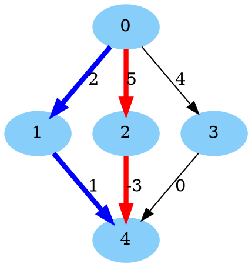
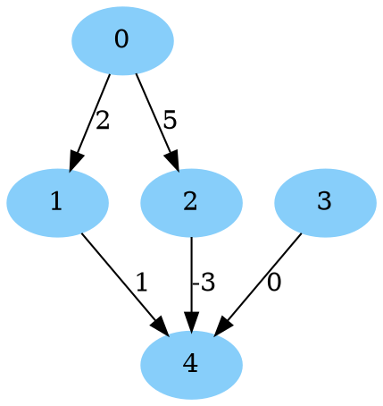
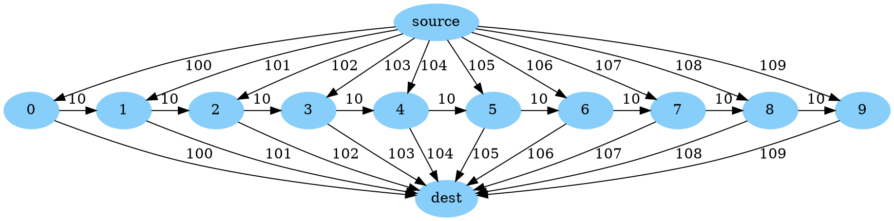

# Multiple shortest (or longest) paths for **D**irected **A**cyclic **G**raphs (DAGs) with dynamic programming

[TOC]

**Directed** graphs without cycles are commonly called DAGs (**D**irected
**A**cyclic **G**raphs). Let $$s$$ and $$t$$ be two fixed nodes of a directed
graph $$G = (N, A)$$ and $$c_a$$ is the length of the arc $$a \in A$$. In the
multiple shortest paths problem, the goal is to determine $$k \geqslant 1$$
paths $$p_1, \ldots , p_k \subset A$$, between $$s$$ and $$t$$, such that
$$p_i$$ have length greater or equal than $$p_{i−1}$$ for $$1 < i \leqslant k$$,
and the remainder paths should have length at least equal to $$p_k$$.

In the case of DAGs, the dynamic program to compute the k-shortest paths from
$$s$$ to $$t$$ runs in $$O(|A| + k|N|\log(d))$$ where $$d$$ is the mean degree
of the graph, faster than in the general cyclic case. Our implementation is an
enhanced version of the algorithm presented in
[Kadivar (2016)](https://toc.ui.ac.ir/article_12602_8c4b300132a9c7b4f66cb1e49e80f1c2.pdf).
Unlike the more general cyclic case, we do not need to assume that our arc
lengths are nonnegative. By negating our objective, we can solve multiple
longest paths problems as well!

> NOTE: Prefer using the simple [shortest path on dag](shortest_path_dag.md) in
> the case of $$k=1$$. It runs in $$O(|N| + |A|)$$ which is asymptotically
> better unless $$d$$ is $$O(1)$$. In practice, it should be much faster even
> for small $$d$$.

## Multiple shortest paths in a DAG

Below, we give an example showing how to solve a multiple shortest paths problem
on a DAG. This example can be found at
[`dag_simple_multiple_shortest_paths.cc`](../samples/dag_simple_multiple_shortest_paths.cc).
Consider the directed graph below:



Our goal is to find the 2-shortest paths from 0 to 4. The bolded red path in the
center is the best with length 2, and the bolded blue path on the left is second
best with length 3.

We solve this using `KShortestPathsOnDag()` from
[`dag_shortest_path.h`](../dag_shortest_path.h)
below:

```cpp
// Snippet from ortools/graph/samples/dag_simple_multiple_shortest_paths.cc
#include <iostream>
#include <vector>

#include "ortools/base/init_google.h"
#include "absl/strings/str_join.h"
#include "ortools/graph/dag_shortest_path.h"

int main(int argc, char** argv) {
  InitGoogle(argv[0], &argc, &argv, true);

  // The input graph, encoded as a list of arcs with distances.
  std::vector<operations_research::ArcWithLength> arcs = {
      {.from = 0, .to = 1, .length = 2},  {.from = 0, .to = 2, .length = 5},
      {.from = 0, .to = 3, .length = 4},  {.from = 1, .to = 4, .length = 1},
      {.from = 2, .to = 4, .length = -3}, {.from = 3, .to = 4, .length = 0}};
  const int num_nodes = 5;

  const int source = 0;
  const int destination = 4;
  const int path_count = 2;
  const std::vector<operations_research::PathWithLength> paths_with_length =
      operations_research::KShortestPathsOnDag(num_nodes, arcs, source,
                                               destination, path_count);

  for (int path_index = 0; path_index < paths_with_length.size();
       ++path_index) {
    std::cout << "#" << (path_index + 1) << " shortest path has length: "
              << paths_with_length[path_index].length << std::endl;
    std::cout << "#" << (path_index + 1) << " shortest path is: "
              << absl::StrJoin(paths_with_length[path_index].node_path, ", ")
              << std::endl;
  }
  return 0;
}
```

Running this code generates the output:

```text
#1 shortest path has length: 2
#1 shortest path is: 0, 2, 4
#2 shortest path has length: 3
#2 shortest path is: 0, 1, 4
```

## One source to all destinations

Similar to the single shortest path case, given a DAG $$G = (N, A)$$, we solve
the problem of find the shortest path from a node $$s \in N$$ to every other
node in $$N$$ (that is reachable). This problem is in fact already solved when
running our dynamic program to compute the shortest path from $$s$$ to $$t$$
(perhaps with a little extra computation at the end). The running time is still
$$O(|A| + k|N|\log(d))$$ to get the path lengths, plus the time build any
desired paths (each path takes time linear its size to build).

For all k-shortest paths *to a single destination* $$t$$, create a new graph on
the same nodes with all arcs reversed, and find the k-shortest paths from $$t$$
to each node, and last reverse the paths.

We will now show an example solving this problem using
[`dag_shortest_path.h`](../dag_shortest_path.h).
Unlike the previous example, we must use the lower level API of
`KShortestPathsOnDagWrapper`, which requires building a
[`util::StaticGraph`](../../graph_base/graph.h) to get started.
(This was done for us by `KShortestPathsOnDag()` in the above examples).

The example below can be found at
[`dag_multiple_shortest_paths_one_to_all.cc`](../samples/dag_multiple_shortest_paths_one_to_all.cc).

Consider the directed graph below:



Our goal is to find the 2-shortest paths from 0 to every reachable node in the
graph, and its total length (note that 3 is not reachable from 0, and 1 and 2
have only one path from 0). We write the code:

```cpp
// Snippet from ortools/graph/samples/dag_multiple_shortest_paths_one_to_all.cc
#include <cstdint>
#include <iostream>
#include <utility>
#include <vector>

#include "ortools/base/init_google.h"
#include "absl/log/check.h"
#include "absl/status/status.h"
#include "absl/status/status_macros.h"
#include "absl/strings/str_join.h"
#include "ortools/graph/dag_shortest_path.h"
#include "ortools/graph_base/graph.h"
#include "ortools/graph_base/topologicalsorter.h"

namespace {

absl::Status Main() {
  util::StaticGraph<>::Builder builder;
  std::vector<double> weights;
  builder.AddArc(0, 1);
  weights.push_back(2.0);
  builder.AddArc(0, 2);
  weights.push_back(5.0);
  builder.AddArc(1, 4);
  weights.push_back(1.0);
  builder.AddArc(2, 4);
  weights.push_back(-3.0);
  builder.AddArc(3, 4);
  weights.push_back(0.0);

  // Static graph reorders the arcs at Build() time, use permutation to get
  // from the old ordering to the new one.
  std::vector<int32_t> permutation;
  const auto graph = std::move(builder).Build(&permutation);
  util::Permute(permutation, &weights);

  // We need a topological order. We can find it by hand on this small graph,
  // e.g., {0, 1, 2, 3, 4}, but we demonstrate how to compute one instead.
  ABSL_ASSIGN_OR_RETURN(const std::vector<int32_t> topological_order,
                        util::graph::FastTopologicalSort(*graph));

  operations_research::KShortestPathsOnDagWrapper<util::StaticGraph<>>
      shortest_paths_on_dag(graph.get(), &weights, topological_order,
                            /*path_count=*/2);
  const int source = 0;
  shortest_paths_on_dag.RunKShortestPathOnDag({source});

  // For each node other than 0, print its distance and the shortest path.
  for (int node = 1; node < 5; ++node) {
    std::cout << "Node " << node << ":\n";
    if (!shortest_paths_on_dag.IsReachable(node)) {
      std::cout << "\tNo path to node " << node << std::endl;
      continue;
    }
    const std::vector<double> lengths = shortest_paths_on_dag.LengthsTo(node);
    const std::vector<std::vector<int32_t>> paths =
        shortest_paths_on_dag.NodePathsTo(node);
    for (int path_index = 0; path_index < lengths.size(); ++path_index) {
      std::cout << "\t#" << (path_index + 1) << " shortest path to node "
                << node << " has length: " << lengths[path_index] << std::endl;
      std::cout << "\t#" << (path_index + 1) << " shortest path to node "
                << node << " is: " << absl::StrJoin(paths[path_index], ", ")
                << std::endl;
    }
  }
  return absl::OkStatus();
}

}  // namespace

int main(int argc, char** argv) {
  InitGoogle(argv[0], &argc, &argv, true);
  QCHECK_OK(Main());
  return 0;
}
```

> NOTE :You can use a `util::ListGraph` from
> [`graph.h`](../../graph_base/graph.h) instead of `util::StaticGraph`
> above, which is simpler as it does not require a `Build()` step and does not
> permute the edges, but it is slower.

Running this code generates the output:

```text
Node 1:
        #1 shortest path to node 1 has length: 2
        #1 shortest path to node 1 is: 0, 1
Node 2:
        #1 shortest path to node 2 has length: 5
        #1 shortest path to node 2 is: 0, 2
Node 3:
        No path to node 3
Node 4:
        #1 shortest path to node 4 has length: 2
        #1 shortest path to node 4 is: 0, 2, 4
        #2 shortest path to node 4 has length: 3
        #2 shortest path to node 4 is: 0, 1, 4
```

## Sequential computations

When we need to solve many k-shortest paths problems on the same DAG
sequentially, possibly with the weights changing between solves, we can do
better than just calling `KShortestPathsOnDag()` in a loop. By using the class
`KShortestPathsOnDagWrapper` (also defined in `dag_shortest_path.h`), we can
reuse some of the computation between shortest path calculations (in particular,
the topological sort, which is also $$O(|N| + |A|)$$), and avoid most memory
allocations. Below, we give an example of how to do this.

The code for this example can be found at
[`dag_multiple_shortest_paths_sequential.cc`](../samples/dag_multiple_shortest_paths_sequential.cc).

We have the following DAG:



The (only) topological order for this graph is `source`, `0`, `1`, ..., `9`,
`dest`.

We let $$M = \{0, 1, \ldots, 9\}$$ be the set of nodes in the middle. With the
initial distances, the shortest path is `source`, `0`, `dest` with cost 200 and
the second shortest path is `source`, `1`, `dest` with cost 202.

We want to solve a sequence of shortest path problems, where in each round, we
pick nodes $$i, j \in M$$, and the edges `source` to $$i$$ and $$j$$ to `dest`
are free (instead of length higher than 100). The first and second shortest
paths cost for each round are:

*   If $$i < j$$,
    *   the shortest path is `source`, `i`, ..., `j`, `dest` with length $$10
        \times (j - i)$$.
    *   the second shortest path is `source`, `i`, `dest` with length $$100 +
        i$$.
*   If $$i > j$$,
    *   the shortest path is `source`, `j`, `dest` with length $$100 +j$$.
    *   the second shortest path is `source`, `i`, `dest` with length $$100 +
        i$$.
*   If $$i = j$$,
    *   the shortest path is `source`, `i`, `dest` with length $$0$$.
    *   the second shortest path is:
        *   if $$i > 0$$, `source`, `i - 1`, `i`, `dest` with length $$100 + i -
            1 + 10$$.
        *   if $$i = 0$$, `source`, `0`, `1`, `dest` with length $$111$$.

We begin with by building our graph using
`util::graph::StaticGraph` (you can also use `util::graph::ListGraph` which is
simpler, but slower) (see `#graph` part).

Next we set up our `KShortestPathsOnDagWrapper` and do an initial shortest path
calculation from `source` to `dest` (see `#first-path` part).

Now, we do three more rounds of calculations, where each round, some arcs have
cost zero (see `#more-paths` part):

*   Round 1: `source -> 2` and `4 -> dest` are free, expected costs 20 and 102.
*   Round 2: `source -> 8` and `1 -> dest` are free, expected cost 101 and 108.
*   Round 3: `source -> 3` and `7 -> dest` are free, expected cost 40 and 103.

The code is below:

```cpp
// Snippet from ortools/graph/samples/dag_multiple_shortest_paths_sequential.cc
#include <cstdint>
#include <iostream>
#include <string>
#include <utility>
#include <vector>

#include "ortools/base/init_google.h"
#include "absl/strings/str_cat.h"
#include "absl/strings/str_join.h"
#include "ortools/graph/dag_shortest_path.h"
#include "ortools/graph_base/graph.h"

int main(int argc, char** argv) {
  InitGoogle(argv[0], &argc, &argv, true);

  // Create a graph with n + 2 nodes, indexed from 0:
  //   * Node n is `source`
  //   * Node n+1 is `dest`
  //   * Nodes M = [0, 1, ..., n-1]  are in the middle.
  //
  // The graph has 3 * n - 1 arcs (with weights):
  //   * (source -> i) with weight 100 + i for i in M
  //   * (i -> dest) with weight 100 + i for i in M
  //   * (i -> (i+1)) with weight 10 for i = 0, ..., n-2
  const int n = 10;
  const int source = n;
  const int dest = n + 1;
  util::StaticGraph<>::Builder builder;
  // There are 3 types of arcs: (1) source to M, (2) M to dest, and (3) within
  // M. This vector stores all of them, first of type (1), then type (2),
  // then type (3). The arcs are ordered by i in M within each type.
  std::vector<double> weights(3 * n - 1);

  for (int i = 0; i < n; ++i) {
    builder.AddArc(source, i);
    weights[i] = 100.0 + i;
  }
  for (int i = 0; i < n; ++i) {
    builder.AddArc(i, dest);
    weights[n + i] = 100.0 + i;
  }
  for (int i = 0; i + 1 < n; ++i) {
    builder.AddArc(i, i + 1);
    weights[2 * n + i] = 10.0;
  }

  // Static graph reorders the arcs at Build() time, use permutation to get from
  // the old ordering to the new one.
  std::vector<int32_t> permutation;
  const auto graph = std::move(builder).Build(&permutation);
  util::Permute(permutation, &weights);

  // A reusable shortest path calculator.
  // We need a topological order. For this structured graph, we find it by hand
  // instead of using util::graph::FastTopologicalSort().
  std::vector<int32_t> topological_order = {source};
  for (int32_t i = 0; i < n; ++i) {
    topological_order.push_back(i);
  }
  topological_order.push_back(dest);

  operations_research::KShortestPathsOnDagWrapper<util::StaticGraph<>>
      shortest_paths_on_dag(graph.get(), &weights, topological_order,
                            /*path_count=*/2);
  shortest_paths_on_dag.RunKShortestPathOnDag({source});

  const std::vector<double> initial_lengths =
      shortest_paths_on_dag.LengthsTo(dest);
  const std::vector<std::vector<int32_t>> initial_paths =
      shortest_paths_on_dag.NodePathsTo(dest);

  std::cout << "No free arcs" << std::endl;
  for (int path_index = 0; path_index < initial_lengths.size(); ++path_index) {
    std::cout << "\t#" << (path_index + 1)
              << " shortest path has length: " << initial_lengths[path_index]
              << std::endl;
    std::cout << "\t#" << (path_index + 1) << " shortest path is: "
              << absl::StrJoin(initial_paths[path_index], ", ") << std::endl;
  }

  // Now, we make a single arc from source to M free, and a single arc from M
  // to dest free, and resolve. If the free edge from the source hits before
  // the free edge to the dest in M, we use both, walking through M. Otherwise,
  // we use only one free arc.
  std::vector<std::pair<int, int>> fast_paths = {
      {2, 4}, {8, 1}, {3, 3}, {0, 0}};
  for (const auto [free_from_source, free_to_dest] : fast_paths) {
    weights[permutation[free_from_source]] = 0;
    weights[permutation[n + free_to_dest]] = 0;

    shortest_paths_on_dag.RunKShortestPathOnDag({source});
    std::cout << "source -> " << free_from_source << " and " << free_to_dest
              << " -> dest are now free" << std::endl;
    std::string label =
        absl::StrCat(" (", free_from_source, ", ", free_to_dest, ")");

    const std::vector<double> lengths = shortest_paths_on_dag.LengthsTo(dest);
    const std::vector<std::vector<int32_t>> paths =
        shortest_paths_on_dag.NodePathsTo(dest);

    for (int path_index = 0; path_index < lengths.size(); ++path_index) {
      std::cout << "\t#" << (path_index + 1) << " shortest path" << label
                << " has length: " << lengths[path_index] << std::endl;
      std::cout << "\t#" << (path_index + 1) << " shortest path" << label
                << " is: " << absl::StrJoin(paths[path_index], ", ")
                << std::endl;
    }

    // Restore the old weights
    weights[permutation[free_from_source]] = 100 + free_from_source;
    weights[permutation[n + free_to_dest]] = 100 + free_to_dest;
  }
  return 0;
}
```

Note that because `StaticGraph` reorders `weights` on `Build()`, we must look up
the new index in `permutation`.

This generates the output:

```text
No free arcs
        #1 shortest path has length: 200
        #1 shortest path is: 10, 0, 11
        #2 shortest path has length: 202
        #2 shortest path is: 10, 1, 11
source -> 2 and 4 -> dest are now free
        #1 shortest path (2, 4) has length: 20
        #1 shortest path (2, 4) is: 10, 2, 3, 4, 11
        #2 shortest path (2, 4) has length: 102
        #2 shortest path (2, 4) is: 10, 2, 11
source -> 8 and 1 -> dest are now free
        #1 shortest path (8, 1) has length: 101
        #1 shortest path (8, 1) is: 10, 1, 11
        #2 shortest path (8, 1) has length: 108
        #2 shortest path (8, 1) is: 10, 8, 11
source -> 3 and 3 -> dest are now free
        #1 shortest path (3, 3) has length: 0
        #1 shortest path (3, 3) is: 10, 3, 11
        #2 shortest path (3, 3) has length: 112
        #2 shortest path (3, 3) is: 10, 2, 3, 11
source -> 0 and 0 -> dest are now free
        #1 shortest path (0, 0) has length: 0
        #1 shortest path (0, 0) is: 10, 0, 11
        #2 shortest path (0, 0) has length: 111
        #2 shortest path (0, 0) is: 10, 0, 1, 11
```

(Above, 10 is `source` and 11 is `dest`.)
