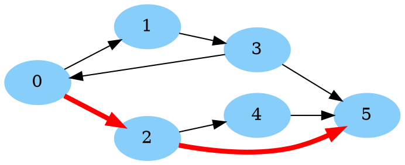
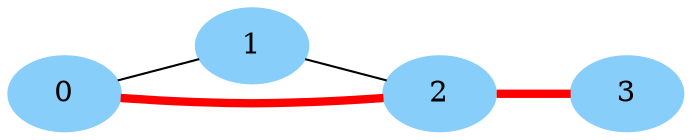
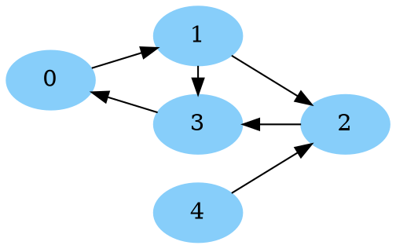

# Shortest Path for unit arc/edge length and Breadth First Search

[TOC]

Below, we give several examples of how to solve shortest path problems on
directed and undirected graphs with **unit arc/edge lengths** (all edges/arcs
have length one) using breadth first search (BFS). These examples use the
functions and classes defined in [`bfs.h`](../graph/bfs.h).
This is a special case of shortest path with nonnegative edge lengths (as
discussed with [Dijkstra's Algorithm](shortest_path_dijkstra.md)) that we can
solve more quickly with breadth first search. Specifically, for a directed graph
$$G = (N, A)$$ with nodes $$N$$ and arcs $$A$$, these algorithms run in $$O(|N|
+ |A|)$$. A forthcoming page will help you determine if the methods in this page
(based on BFS) are best for your problem.

## Directed Graphs

Below, we give an example showing how to solve a shortest path problem on a
directed graph with unit arc lengths. This example can be found at
[`bfs_directed.cc`](http://google3/third_party/ortools/ortools/graph_base/samples/bfs_directed.cc).
Consider the directed graph below:



Our goal is to find the shortest path from 0 to 5 (shown in red in the image)
and its total length.

We solve this using [`GetBFSRootedTree()`](http://cs/symbol:GetBFSRootedTree)
and [`GetBFSShortestPath()`](http://cs/symbol:GetBFSShortestPath) and from
[`bfs.h`](../graph/bfs.h) below:

```cpp
// Snippet from ortools/graph_base/samples/bfs_directed.cc
#include <iostream>
#include <utility>
#include <vector>

#include "ortools/base/init_google.h"
#include "absl/log/check.h"
#include "absl/status/status.h"
#include "absl/status/status_macros.h"
#include "absl/strings/str_join.h"
#include "ortools/graph_base/bfs.h"

namespace {

absl::Status Main() {
  // The arcs of this directed graph are encoded as a list of pairs, where
  // .first is the source and .second is the destination of each arc.
  const std::vector<std::pair<int, int>> arcs = {
      {0, 1}, {0, 2}, {1, 3}, {2, 4}, {2, 5}, {3, 0}, {3, 5}, {4, 5}};
  const int num_nodes = 6;

  // Transform the graph to an adjacency_list
  std::vector<std::vector<int>> adjacency_list(num_nodes);
  for (const auto& [start, end] : arcs) {
    adjacency_list[start].push_back(end);
  }

  // Solve the shortest path problem from 0 to 5.
  const int source = 0;
  const int terminal = 5;
  ABSL_ASSIGN_OR_RETURN(
      const std::vector<int> bfs_tree,
      util::graph::GetBFSRootedTree(adjacency_list, num_nodes, source));
  ABSL_ASSIGN_OR_RETURN(const std::vector<int> shortest_path,
                        util::graph::GetBFSShortestPath(bfs_tree, terminal));

  // Print to length of the path and then the nodes in the path.
  std::cout << "Shortest path length (in arcs): " << shortest_path.size() - 1
            << std::endl;
  std::cout << "Shortest path nodes: " << absl::StrJoin(shortest_path, ", ")
            << std::endl;

  return absl::OkStatus();
}

}  // namespace

int main(int argc, char** argv) {
  InitGoogle(argv[0], &argc, &argv, true);
  QCHECK_OK(Main());
  return 0;
}
```

This generates the output:

```text
Shortest path length (in arcs): 2
Shortest path nodes: 0, 2, 5
```

## Undirected Graphs

Below, we give an example showing how to solve a shortest path problem on a
undirected graph with unit arc lengths. This example can be found at
[`bfs_undirected.cc`](http://cs/file:ortools/graph_base/samples/bfs_directed.cc).
Consider the directed graph below:



Our goal is to find the shortest path from 0 to 3 (shown in red in the image) as
measured by the number of edges.

Again, we solve this using
[`GetBFSRootedTree()`](http://cs/symbol:GetBFSRootedTree) and
[`GetBFSShortestPath()`](http://cs/symbol:GetBFSShortestPath) and from
[`bfs.h`](../graph/bfs.h). Since these functions only work on
**directed graphs**, we simply include two copies of the edge when creating the
input arcs, one in each direction. The code is below:

```cpp
// Snippet from ortools/graph_base/samples/bfs_undirected.cc
#include <iostream>
#include <utility>
#include <vector>

#include "ortools/base/init_google.h"
#include "absl/log/check.h"
#include "absl/status/status.h"
#include "absl/status/status_macros.h"
#include "absl/strings/str_join.h"
#include "ortools/graph_base/bfs.h"

namespace {

absl::Status Main() {
  // The edges of this undirected graph encoded as a list of pairs, where .first
  // and .second are the endpoints of each edge (the order does not matter).
  const std::vector<std::pair<int, int>> edges = {
      {0, 1}, {0, 2}, {1, 2}, {2, 3}};
  const int num_nodes = 4;

  // Transform the graph to an adjacency_list
  std::vector<std::vector<int>> adjacency_list(num_nodes);
  for (const auto& [node1, node2] : edges) {
    // Include both orientations of the edge
    adjacency_list[node1].push_back(node2);
    adjacency_list[node2].push_back(node1);
  }

  // Solve the shortest path problem from 0 to 3.
  const int source = 0;
  const int terminal = 3;
  ABSL_ASSIGN_OR_RETURN(
      const std::vector<int> bfs_tree,
      util::graph::GetBFSRootedTree(adjacency_list, num_nodes, source));
  ABSL_ASSIGN_OR_RETURN(const std::vector<int> shortest_path,
                        util::graph::GetBFSShortestPath(bfs_tree, terminal));

  // Print to length of the path and then the nodes in the path.
  std::cout << "Shortest path length (in arcs): " << shortest_path.size() - 1
            << std::endl;
  std::cout << "Shortest path nodes: " << absl::StrJoin(shortest_path, ", ")
            << std::endl;

  return absl::OkStatus();
}

}  // namespace

int main(int argc, char** argv) {
  InitGoogle(argv[0], &argc, &argv, true);
  QCHECK_OK(Main());
  return 0;
}
```

This generates the output:

```text
Shortest path length (in arcs): 2
Shortest path nodes: 0, 2, 3
```

## One source to all destinations

Given a directed graph $$G = (N, A)$$, we solve the problem of find the shortest
path from a node $$s \in N$$ to every other node in $$N$$ (that is reachable),
where each arc contributes a length of one to the path. This problem is in fact
already solved when BFS (we can get call path lengths in time $$O(|N| + |A|)$$).
If we want the actual paths, generating them takes time linear in the path size.

A few variations of this problem can be reduced to this case:

*   For all paths *to a single destination* $$t$$, create a new graph on the
    same nodes with all arcs reversed, and find the shortest path from $$t$$ to
    each node, and last reverse the paths.
*   For *undirected* graphs, double the edges as done
    [above](#undirected-graphs).

Again, we solve this using
[`GetBFSRootedTree()`](http://cs/symbol:GetBFSRootedTree) and
[`GetBFSShortestPath()`](http://cs/symbol:GetBFSShortestPath) and from
[`bfs.h`](../graph/bfs.h).

The example below can be found at
[`bfs_one_to_all.cc`](http://google3/third_party/ortools/ortools/graph_base/samples/bfs_one_to_all.cc).

Consider the directed graph below:



Our goal is to find the shortest path from 0 to every reachable node in the
graph, and its total length (note that 4 is not reachable from 0). We write the
code:

```cpp
// Snippet from ortools/graph_base/samples/bfs_one_to_all.cc
#include <iostream>
#include <utility>
#include <vector>

#include "ortools/base/init_google.h"
#include "absl/log/check.h"
#include "absl/status/status.h"
#include "absl/status/status_macros.h"
#include "absl/strings/str_join.h"
#include "ortools/graph_base/bfs.h"

namespace {

absl::Status Main() {
  // The arcs of this directed graph are encoded as a list of pairs, where
  // .first is the source and .second is the destination of each arc.
  const std::vector<std::pair<int, int>> arcs = {{0, 1}, {1, 2}, {1, 3},
                                                 {2, 3}, {3, 0}, {4, 2}};
  const int num_nodes = 5;

  // Transform the graph to an adjacency_list
  std::vector<std::vector<int>> adjacency_list(num_nodes);
  for (const auto& [start, end] : arcs) {
    adjacency_list[start].push_back(end);
  }

  // Compute the shortest path from 0 to each reachable node.
  const int source = 0;
  ABSL_ASSIGN_OR_RETURN(
      const std::vector<int> bfs_tree,
      util::graph::GetBFSRootedTree(adjacency_list, num_nodes, source));
  // Runs in O(num nodes). Nodes that are not reachable have distance -1.
  ABSL_ASSIGN_OR_RETURN(const std::vector<int> node_distances,
                        util::graph::GetBFSDistances(bfs_tree));
  for (int t = 0; t < num_nodes; ++t) {
    if (t == source) {
      continue;
    }
    if (node_distances[t] >= 0) {
      ABSL_ASSIGN_OR_RETURN(const std::vector<int> shortest_path,
                            util::graph::GetBFSShortestPath(bfs_tree, t));
      std::cout << "Shortest path from 0 to " << t
                << " has length: " << node_distances[t] << std::endl;
      std::cout << "Path is: " << absl::StrJoin(shortest_path, ", ")
                << std::endl;
    } else {
      std::cout << "No path from 0 to " << t << std::endl;
    }
  }
  return absl::OkStatus();
}

}  // namespace

int main(int argc, char** argv) {
  InitGoogle(argv[0], &argc, &argv, true);
  QCHECK_OK(Main());
  return 0;
}
```

This code generates the output:

```text
Shortest path from 0 to 1 has length: 1
Path is: 0, 1
Shortest path from 0 to 2 has length: 2
Path is: 0, 1, 2
Shortest path from 0 to 3 has length: 2
Path is: 0, 1, 3
No path from 0 to 4
```
