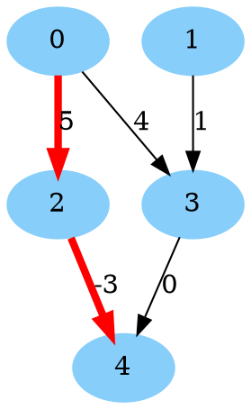
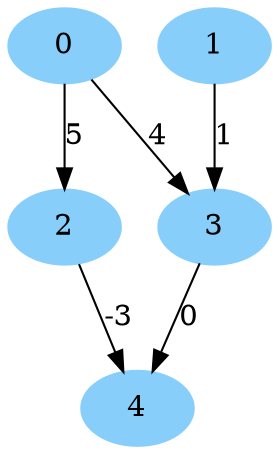
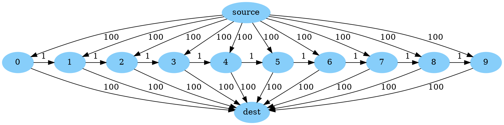

# Shortest (or longest) path for **D**irected **A**cyclic **G**raphs (DAGs) with dynamic programming

[TOC]

**Directed** graphs without cycles are commonly called DAGs (**D**irected
**A**cyclic **G**raphs). We can solve shortest path problems on these graphs
using dynamic programming. On a directed graph $$G = (N, A)$$, the dynamic
program to compute the shortest path from $$s$$ to $$t$$ runs in $$O(|N| +
|A|)$$, faster than in the general cyclic case. And unlike the more general
cyclic case (covered by [Dijkstra's Algorithm](shortest_path_dijkstra.md)), we
do not need to assume that our arc lengths are nonnegative. By negating our
objective, we can solve longest path problems as well! For variants of this
problem, see [Multiple shortest paths](multiple_shortest_paths_dag.md) for more
than a single shortest path and
[Constrained shortest paths](constrained_shortest_path_dag.md) if there are
additional constraints on the path.

**Undirected** graphs without cycles are trees (or forests, if not connected).
Any pair of nodes is connected by only a single path (which does not repeat
nodes), and you can find this by traversing the tree. See
[Paths in Trees](tree_path.md) for these problems.

## Shortest path in a DAG

Below, we give an example showing how to solve a shortest path problem on a DAG.
This example can be found at
[`dag_simple_shortest_path.cc`](../samples/dag_simple_shortest_path.cc).

Consider the directed graph below:



Our goal is to find the shortest path from 0 to 4 (shown in red in the image)
and its total length.

We solve this using
[`ShortestPathsOnDag()`](http://cs/symbol:ShortestPathsOnDag) from
[`dag_shortest_path.h`](http://cs/file:dag_shortest_path.h) below:

```cpp
// Snippet from ortools/graph/samples/dag_simple_shortest_path.cc
#include <iostream>
#include <vector>

#include "ortools/base/init_google.h"
#include "absl/strings/str_join.h"
#include "ortools/graph/dag_shortest_path.h"

int main(int argc, char** argv) {
  InitGoogle(argv[0], &argc, &argv, true);

  // The input graph, encoded as a list of arcs with distances.
  std::vector<operations_research::ArcWithLength> arcs = {
      {.from = 0, .to = 2, .length = 5},
      {.from = 0, .to = 3, .length = 4},
      {.from = 1, .to = 3, .length = 1},
      {.from = 2, .to = 4, .length = -3},
      {.from = 3, .to = 4, .length = 0}};
  const int num_nodes = 5;

  const int source = 0;
  const int destination = 4;
  const operations_research::PathWithLength path_with_length =
      operations_research::ShortestPathsOnDag(num_nodes, arcs, source,
                                              destination);

  // Print to length of the path and then the nodes in the path.
  std::cout << "Shortest path length: " << path_with_length.length << std::endl;
  std::cout << "Shortest path nodes: "
            << absl::StrJoin(path_with_length.node_path, ", ") << std::endl;
  return 0;
}
```

Running this code generates the output:

```text
Shortest path length: 2
Shortest path nodes: 0, 2, 4
```

## One source to all destinations

Given a DAG $$G = (N, A)$$, we solve the problem of find the shortest path from
a node $$s \in N$$ to every other node in $$N$$ (that is reachable). This
problem is in fact already solved when running our dynamic program to compute
the shortest path from $$s$$ to $$t$$ (perhaps with a little extra computation
at the end). The running time is still $$O(|N| + |A|)$$ to get the path lengths,
plus the time build any desired paths (each path takes time linear its size to
build).

For all paths *to a single destination* $$t$$, create a new graph on the same
nodes with all arcs reversed, and find the shortest path from $$t$$ to each
node, and last reverse the paths.

We will now show an example solving this problem using
[`dag_shortest_path.h`](http://cs/file:dag_shortest_path.h). Unlike the previous
example, we must use the lower level API of
[`ShortestPathsOnDagWrapper`](http://cs/symbol:ShortestPathsOnDagWrapper), which
requires building a
[`util::StaticGraph`](http://cs/file:google3/ortools/graph_base/graph.h symbol:StaticGraph)
to get started. (This was done for us by
[`ShortestPathsOnDag()`](http://cs/symbol:ShortestPathsOnDag) in the above
examples).

The example below can be found at
[`dag_shortest_path_one_to_all.cc`](http://cs/file:ortools/graph/samples/dag_shortest_path_one_to_all.cc).

Consider the directed graph below:



Our goal is to find the shortest path from 0 to every reachable node in the
graph, and its total length (note that 1 is not reachable from 0). We write the
code:

```cpp
// Snippet from ortools/graph/samples/dag_shortest_path_one_to_all.cc
#include <cstdint>
#include <iostream>
#include <utility>
#include <vector>

#include "ortools/base/init_google.h"
#include "absl/log/check.h"
#include "absl/status/status.h"
#include "ortools/base/status_macros.h"
#include "absl/strings/str_join.h"
#include "ortools/graph/dag_shortest_path.h"
#include "ortools/graph_base/graph.h"
#include "ortools/graph_base/topologicalsorter.h"

namespace {
absl::Status Main() {
  util::StaticGraph<>::Builder builder;
  std::vector<double> weights;
  builder.AddArc(0, 2);
  weights.push_back(5.0);
  builder.AddArc(0, 3);
  weights.push_back(4.0);
  builder.AddArc(1, 3);
  weights.push_back(1.0);
  builder.AddArc(2, 4);
  weights.push_back(-3.0);
  builder.AddArc(3, 4);
  weights.push_back(0.0);

  // Static graph reorders the arcs at build time, use permutation to get
  // from the old ordering to the new one.
  const auto graph = std::move(builder).BuildAndPermute(weights);

  // We need a topological order. We can find it by hand on this small graph,
  // e.g., {0, 1, 2, 3, 4}, but we demonstrate how to compute one instead.
  OR_ASSIGN_OR_RETURN(const std::vector<int32_t> topological_order,
                        util::graph::FastTopologicalSort(*graph));

  operations_research::ShortestPathsOnDagWrapper<util::StaticGraph<>>
      shortest_path_on_dag(graph.get(), &weights, topological_order);
  const int source = 0;
  shortest_path_on_dag.RunShortestPathOnDag({source});

  // For each node other than 0, print its distance and the shortest path.
  for (int i = 1; i < 5; ++i) {
    if (shortest_path_on_dag.IsReachable(i)) {
      std::cout << "Length of shortest path to node " << i << ": "
                << shortest_path_on_dag.LengthTo(i) << std::endl;
      std::cout << "Shortest path to node " << i << ": "
                << absl::StrJoin(shortest_path_on_dag.NodePathTo(i), ", ")
                << std::endl;

    } else {
      std::cout << "No path to node: " << i << std::endl;
    }
  }
  return absl::OkStatus();
}

}  // namespace

int main(int argc, char** argv) {
  InitGoogle(argv[0], &argc, &argv, true);
  QCHECK_OK(Main());
  return 0;
}
```

> NOTE :You can use a
> [`util::ListGraph`](http://cs/file:google3/ortools/graph_base/graph.h symbol:ListGraph)
> instead of `util::StaticGraph` above, which is simpler as it does not require
> a `Build()` step and does not permute the edges, but it is slower.

Running this code generates the output:

```text
No path to node: 1
Length of shortest path to node 2: 5
Shortest path to node 2: 0, 2
Length of shortest path to node 3: 4
Shortest path to node 3: 0, 3
Length of shortest path to node 4: 2
Shortest path to node 4: 0, 2, 4
```

## Sequential computations

When we need to solve many shortest path problems on the same DAG sequentially,
possibly with the weights changing between solves, we can do better than just
calling `ShortestPathsOnDag()` in a loop. By using the class
`ShortestPathsOnDagWrapper` (also defined in `dag_shortest_path.h`), we can
reuse some of the computation between shortest path calculations (in particular,
the topological sort, which is also $$O(|N| + |A|)$$), and avoid most memory
allocations. Below, we give an example of how to do this.

This example is a variation on our
[sequential example](shortest_path_dijkstra.md#sequential-computations) for
Dijkstra's algorithm (for graphs with nonnegative arc lengths that may contain
cycles) with one arc removed to make the graph acyclic.

The code for this example can be found at
[`dag_shortest_path_sequential.cc`](http://cs/file:ortools/graph/samples/dag_shortest_path_sequential.cc).

We have the following DAG:



The (only) topological order for this graph is `source`, `0`, `1`, ..., `9`,
`dest`.

We let $$M = \{0, 1, \ldots, 9\}$$ be the set of nodes in the middle. With the
initial distances, all shortest paths from `source` to `dest` pass through a
single node in $$M$$ and have total cost 200.

We want to solve a sequence of shortest path problems, where in each round, we
pick nodes $$i, j \in M$$, and the edges `source` to $$i$$ and $$j$$ to `dest`
are free (instead of length 100). The shortest path cost for each round is:

*   If $$i \leq j$$, then $$j - i$$, the distance from $$i$$ to $$j$$ when
    moving through $$M$$. For example, if $$i=2$$ and $$j=4$$, the shortest path
    is `source`, `2`, `3`, `4`, `dest`, and has length 2.
*   If $$i > j$$, then 100. There are two paths with this cost, `source`, `i`,
    `dest`, and `source`, `j`, `dest`. Note that there is no path from $$i$$ to
    $$j$$ through $$M$$ in this case.

We begin with by building our graph using `util::graph::StaticGraph` (you can
also use `util::graph::ListGraph` which is simpler, but slower) (see `#graph`
part).

Next we set up our `ShortestPathsOnDagWrapper` and do an initial shortest path
calculation from `source` to `dest` (see `#first-path` part).

Now, we do three more rounds of calculations, where each round, some arcs have
cost zero (see `#more-paths` part):

*   Round 1: `source -> 2` and `4 -> dest` are free, expected cost 2
*   Round 2: `source -> 8` and `1 -> dest` are free, expected cost 100
*   Round 3: `source -> 3` and `7 -> dest` are free, expected cost 4

The code is below:

```cpp
// Snippet from ortools/graph/samples/dag_shortest_path_sequential.cc
#include <cstdint>
#include <iostream>
#include <string>
#include <utility>
#include <vector>

#include "ortools/base/init_google.h"
#include "absl/strings/str_cat.h"
#include "absl/strings/str_join.h"
#include "ortools/graph/dag_shortest_path.h"
#include "ortools/graph_base/graph.h"

int main(int argc, char** argv) {
  InitGoogle(argv[0], &argc, &argv, true);

  // Create a graph with n + 2 nodes, indexed from 0:
  //   * Node n is `source`
  //   * Node n+1 is `dest`
  //   * Nodes M = [0, 1, ..., n-1]  are in the middle.
  //
  // The graph has 3 * n - 1 arcs (with weights):
  //   * (source -> i) with weight 100 for i in M
  //   * (i -> dest) with weight 100 for i in M
  //   * (i -> (i+1)) with weight 1 for i = 0, ..., n-2
  //
  // Every path [source, i, dest] for i in M is a shortest path from source to
  // dest with weight 200.
  const int n = 10;
  const int source = n;
  const int dest = n + 1;
  util::StaticGraph<>::Builder builder;
  // There are 3 types of arcs: (1) source to M, (2) M to dest, and (3) within
  // M. This vector stores all of them, first of type (1), then type (2),
  // then type (3). The arcs are ordered by i in M within each type.
  std::vector<double> weights(3 * n - 1);

  for (int i = 0; i < n; ++i) {
    builder.AddArc(source, i);
    weights[i] = 100.0;
  }
  for (int i = 0; i < n; ++i) {
    builder.AddArc(i, dest);
    weights[n + i] = 100.0;
  }
  for (int i = 0; i + 1 < n; ++i) {
    builder.AddArc(i, i + 1);
    weights[2 * n + i] = 1.0;
  }

  // Static graph reorders the arcs at Build() time, use permutation to get from
  // the old ordering to the new one.
  std::vector<int32_t> permutation;
  const auto graph = std::move(builder).Build(&permutation);
  util::Permute(permutation, &weights);

  // A reusable shortest path calculator.
  // We need a topological order. For this structured graph, we find it by hand
  // instead of using util::graph::FastTopologicalSort().
  std::vector<int32_t> topological_order = {source};
  for (int i = 0; i < n; ++i) {
    topological_order.push_back(i);
  }
  topological_order.push_back(dest);

  operations_research::ShortestPathsOnDagWrapper<util::StaticGraph<>>
      shortest_path_on_dag(graph.get(), &weights, topological_order);
  shortest_path_on_dag.RunShortestPathOnDag({source});

  std::cout << "Initial distance: " << shortest_path_on_dag.LengthTo(dest)
            << std::endl;
  std::cout << "Initial path: "
            << absl::StrJoin(shortest_path_on_dag.NodePathTo(dest), ", ")
            << std::endl;

  // Now, we make a single arc from source to M free, and a single arc from M
  // to dest free, and resolve. If the free edge from the source hits before
  // the free edge to the dest in M, we use both, walking through M. Otherwise,
  // we use only one free arc.
  std::vector<std::pair<int, int>> fast_paths = {{2, 4}, {8, 1}, {3, 7}};
  for (const auto [free_from_source, free_to_dest] : fast_paths) {
    weights[permutation[free_from_source]] = 0;
    weights[permutation[n + free_to_dest]] = 0;

    shortest_path_on_dag.RunShortestPathOnDag({source});
    std::cout << "source -> " << free_from_source << " and " << free_to_dest
              << " -> dest are now free" << std::endl;
    std::string label = absl::StrCat("_", free_from_source, "_", free_to_dest);
    std::cout << "Distance" << label << ": "
              << shortest_path_on_dag.LengthTo(dest) << std::endl;
    std::cout << "Path" << label << ": "
              << absl::StrJoin(shortest_path_on_dag.NodePathTo(dest), ", ")
              << std::endl;

    // Restore the old weights
    weights[permutation[free_from_source]] = 100;
    weights[permutation[n + free_to_dest]] = 100;
  }
  return 0;
}
```

Note that because `StaticGraph` reorders `weights` on `Build()`, we must look up
the new index in `permutation`.

This generates the output:

```text
Initial distance: 200
Initial path: 10, 0, 11
source -> 2 and 4 -> dest are now free
Distance_2_4: 2
Path_2_4: 10, 2, 3, 4, 11
source -> 8 and 1 -> dest are now free
Distance_8_1: 100
Path_8_1: 10, 1, 11
source -> 3 and 7 -> dest are now free
Distance_3_7: 4
Path_3_7: 10, 3, 4, 5, 6, 7, 11
```

(Above, 10 is `source` and 11 is `dest`.)
