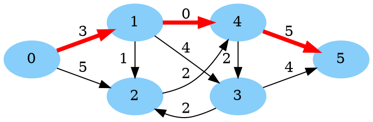
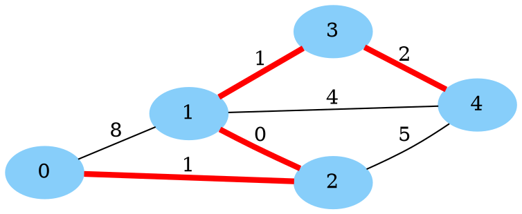
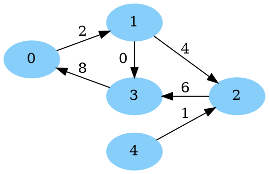
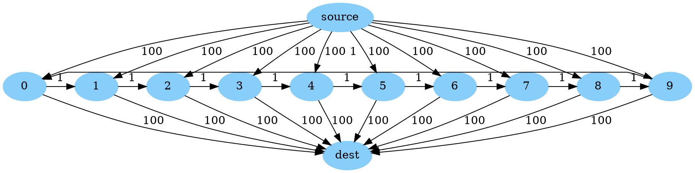

# Shortest Path and Dijkstra's Algorithm

[TOC]

Below, we give several examples of how to solve shortest path problems on
directed and undirected graphs with nonnegative arc/edge lengths using the
functions and classes defined in
[`bounded_dijkstra.h`](http://cs/file:bounded_dijkstra.h). A forthcoming page
will help you determine if the methods in this page (based on Dijkstra's
algorithm) are best for your problem.

## Directed Graphs

Below, we give an example showing how to solve a shortest path problem on a
directed graph with nonnegative arc lengths. This example can be found at
[`dijkstra_directed.cc`](../samples/dijkstra_directed.cc).
Consider the directed graph below:



Our goal is to find the shortest path from 0 to 5 (shown in red in the image)
and its total length.

We solve this using
[`SimpleOneToOneShortestPath()`](http://cs/symbol:SimpleOneToOneShortestPath)
from [`bounded_dijkstra.h`](http://cs/file:bounded_dijkstra.h) below:

```cpp
// Snippet from ortools/graph/samples/dijkstra_directed.cc
#include <iostream>
#include <utility>
#include <vector>

#include "ortools/base/init_google.h"
#include "absl/strings/str_join.h"
#include "ortools/graph/bounded_dijkstra.h"

namespace {
struct Arc {
  int start = 0;
  int end = 0;
  int length = 0;
};
}  // namespace

int main(int argc, char** argv) {
  InitGoogle(argv[0], &argc, &argv, true);

  // The input graph, encoded as a list of arcs with distances.
  std::vector<Arc> arcs = {
      {.start = 0, .end = 1, .length = 3}, {.start = 0, .end = 2, .length = 5},
      {.start = 1, .end = 2, .length = 1}, {.start = 1, .end = 3, .length = 4},
      {.start = 1, .end = 4, .length = 0}, {.start = 2, .end = 4, .length = 2},
      {.start = 3, .end = 2, .length = 2}, {.start = 3, .end = 5, .length = 4},
      {.start = 4, .end = 3, .length = 2}, {.start = 4, .end = 5, .length = 5}};

  // Transform the graph.
  std::vector<int> tails;
  std::vector<int> heads;
  std::vector<int> lengths;
  for (const Arc& arc : arcs) {
    tails.push_back(arc.start);
    heads.push_back(arc.end);
    lengths.push_back(arc.length);
  }

  // Solve the shortest path problem from 0 to 5.
  std::pair<int, std::vector<int>> result =
      operations_research::SimpleOneToOneShortestPath<int, int>(0, 5, tails,
                                                                heads, lengths);

  // Print to length of the path and then the nodes in the path.
  std::cout << "Shortest path length: " << result.first << std::endl;
  std::cout << "Shortest path nodes: " << absl::StrJoin(result.second, ", ")
            << std::endl;
  return 0;
}
```

Running this code generates the output:

```text
Shortest path length: 8
Shortest path nodes: 0, 1, 4, 5
```

## Undirected Graphs

Below, we give an example showing how to solve a shortest path problem on an
undirected graph with nonnegative edge lengths. This example can be found at
[`dijkstra_undirected.cc`](../samples/dijkstra_undirected.cc).
Consider the undirected graph below:



Our goal is to find the shortest path from 0 to 4 (shown in red in the image)
and its total length.

Again, we solve this using
[`SimpleOneToOneShortestPath()`](http://cs/symbol:SimpleOneToOneShortestPath)
from [`bounded_dijkstra.h`](http://cs/file:bounded_dijkstra.h). Since this
function only works on **directed graphs**, we simply include two copies of the
edge when creating the input arcs, one in each direction. The code is below:

```cpp
// Snippet from ortools/graph/samples/dijkstra_undirected.cc
#include <iostream>
#include <utility>
#include <vector>

#include "ortools/base/init_google.h"
#include "absl/strings/str_join.h"
#include "ortools/graph/bounded_dijkstra.h"

namespace {
// An edge in an undirected graph, the order of the endpoints does not matter.
struct Edge {
  int endpoint1 = 0;
  int endpoint2 = 0;
  int length = 0;
};
}  // namespace

int main(int argc, char** argv) {
  InitGoogle(argv[0], &argc, &argv, true);

  // The input graph, encoded as a list of edges with distances.
  std::vector<Edge> edges = {
      {.endpoint1 = 0, .endpoint2 = 1, .length = 8},
      {.endpoint1 = 0, .endpoint2 = 2, .length = 1},
      {.endpoint1 = 1, .endpoint2 = 2, .length = 0},
      {.endpoint1 = 1, .endpoint2 = 3, .length = 1},
      {.endpoint1 = 1, .endpoint2 = 4, .length = 4},
      {.endpoint1 = 2, .endpoint2 = 4, .length = 5},
      {.endpoint1 = 3, .endpoint2 = 4, .length = 2},
  };

  // Transform the graph.
  std::vector<int> tails;
  std::vector<int> heads;
  std::vector<int> lengths;
  for (const Edge& edge : edges) {
    // The "forward" directed edge
    tails.push_back(edge.endpoint1);
    heads.push_back(edge.endpoint2);
    lengths.push_back(edge.length);
    // The "backward" directed edge
    tails.push_back(edge.endpoint2);
    heads.push_back(edge.endpoint1);
    lengths.push_back(edge.length);
  }

  // Solve the shortest path problem from 0 to 4.
  std::pair<int, std::vector<int>> result =
      operations_research::SimpleOneToOneShortestPath<int, int>(0, 4, tails,
                                                                heads, lengths);

  // Print to length of the path and then the nodes in the path.
  std::cout << "Shortest path length: " << result.first << std::endl;
  std::cout << "Shortest path nodes: " << absl::StrJoin(result.second, ", ")
            << std::endl;
  return 0;
}
```

This code generates the following output:

```text
Shortest path length: 4
Shortest path nodes: 0, 2, 1, 3, 4
```

## One source to all destinations

Given a directed graph $$G = (N, A)$$, we solve the problem of find the shortest
path from a node $$s \in N$$ to every other node in $$N$$ (that is reachable).
This problem is in fact already solved when running Dijkstra's algorithm to
compute the shortest path from $$s$$ to $$t$$ (perhaps with a little extra
computation at the end). The running time is $$O(|A| \log(|N|))$$, to get the
path lengths, plus the time build any desired paths (each path takes time linear
its size to build).

A few variations of this problem can be reduced to this case:

*   For all paths *to a single destination* $$t$$, create a new graph on the
    same nodes with all arcs reversed, and find the shortest path from $$t$$ to
    each node, and last reverse the paths.
*   For *undirected* graphs, double the edges as done
    [above](#undirected-graphs).

We will now show an example solving this problem using
[`bounded_dijkstra.h`](http://cs/file:bounded_dijkstra.h). Unlike the previous
examples, we must use the lower level API of
[`BoundedDijkstraWrapper`](http://cs/symbol:BoundedDijkstraWrapper), which
requires building a
[`util::StaticGraph`](http://cs/file:google3/ortools/graph_base/graph.h symbol:StaticGraph)
to get started. (This was done for us by
[`SimpleOneToOneShortestPath()`](http://cs/symbol:SimpleOneToOneShortestPath) in
the above examples).

The example below can be found at
[`dijkstra_one_to_all.cc`](../samples/dijkstra_one_to_all.cc).

Consider the directed graph below:



Our goal is to find the shortest path from 0 to every reachable node in the
graph, and its total length (note that 4 is not reachable from 0). We write the
code:

```cpp
// Snippet from ortools/graph/samples/dijkstra_one_to_all.cc
#include <cstdint>
#include <iostream>
#include <utility>
#include <vector>

#include "ortools/base/init_google.h"
#include "ortools/base/types.h"
#include "absl/strings/str_join.h"
#include "ortools/graph/bounded_dijkstra.h"
#include "ortools/graph_base/graph.h"

int main(int argc, char** argv) {
  InitGoogle(argv[0], &argc, &argv, true);

  // Create the graph
  util::StaticGraph<>::Builder builder(5, 6);
  std::vector<int> weights;
  builder.AddArc(0, 1);
  weights.push_back(2);
  builder.AddArc(1, 2);
  weights.push_back(4);
  builder.AddArc(1, 3);
  weights.push_back(0);
  builder.AddArc(2, 3);
  weights.push_back(6);
  builder.AddArc(3, 0);
  weights.push_back(8);
  builder.AddArc(4, 2);
  weights.push_back(1);

  // Static graph reorders the arcs at Build() time, use permutation to get
  // from the old ordering to the new one.
  std::vector<int32_t> permutation;
  const auto graph = std::move(builder).Build(&permutation);
  util::Permute(permutation, &weights);

  // Compute the shortest path to each reachable node.
  operations_research::BoundedDijkstraWrapper<util::StaticGraph<>, int>
      dijkstra(graph.get(), &weights);
  const std::vector<int> reachable_from_zero = dijkstra.RunBoundedDijkstra(
      /*source_node=*/0, /*distance_limit=*/kint32max);

  // Print paths from zero to the reachable nodes ordered by distance.
  for (const int dest : reachable_from_zero) {
    const int distance = dijkstra.distances()[dest];
    const std::vector<int32_t> path = dijkstra.NodePathTo(dest);
    std::cout << "Distance to " << dest << ": " << distance << std::endl;
    std::cout << "Path to " << dest << ": " << absl::StrJoin(path, ", ")
              << std::endl;
  }
}
```

> NOTE: You can use a
> [`util::ListGraph`](../graph/graph.h symbol:ListGraph)
> instead of `util::StaticGraph` above, which is simpler as it does not require
> a `Build()` step and does not permute the edges, but it is slower.

Running this code generates the output:

```text
Distance to 0: 0
Path to 0: 0
Distance to 1: 2
Path to 1: 0, 1
Distance to 2: 6
Path to 2: 0, 1, 2
Distance to 3: 2
Path to 3: 0, 1, 3
```

## Sequential computations

When we need to solve many shortest path problems on the same graph
sequentially, possibly with the weights changing between solves, we can do
better than just calling `SimpleOneToOneShortestPath()` in a loop. By using the
class `BoundedDijkstraWrapper` (also defined in `bounded_dijkstra.h`), we can
reuse some of the computation between shortest path calculations, and avoid most
memory allocations. Below, we give an example of how to do this.

The code for this example can be found at
[`dijkstra_sequential.cc`](../samples/dijkstra_sequential.cc).

This example is on a directed graph. This method also applies for undirected
problems, using the same technique from our
[previous example](#undirected-graphs), creating a directed graph with arcs in
both directions for each edge in the undirected graph.

We have the following graph:



We let $$M = \{0, 1, \ldots, 9\}$$ be the set of nodes in the middle. With the
initial distances, all shortest paths from `source` to `dest` pass through a
single node in $$M$$ and have total cost 200.

However, we want to solve a sequence of shortest path problems, where in each
round, we pick nodes $$i, j \in M$$, and the edges `source` to $$i$$ and $$j$$
to `dest` are free (instead of length 100). Then, the shortest path is just the
distance from $$i$$ to $$j$$ when moving through $$M$$. For example, if $$i=2$$
and $$j=4$$, the shortest path is source, 2, 3, 4, dest, and has length 2.

We begin with by building our graph using
`util::graph::StaticGraph` (you can also use `util::graph::ListGraph` which is
simpler, but slower) (see `#graph` part).

Next we set up our `BoundedDijkstraWrapper` and do an initial shortest path
calculation from `source` to `dest` (see `#first-path` part).

Now, we do three more rounds of calculations, where each round, some arcs have
cost zero (see `#more-paths` part):

*   Round 1: `source -> 2` and `4 -> dest` are free
*   Round 2: `source -> 8` and `1 -> dest` are free
*   Round 3: `source -> 3` and `7 -> dest` are free

The code is below:

```cpp
// Snippet from ortools/graph/samples/dijkstra_sequential.cc
#include <cstdint>
#include <iostream>
#include <string>
#include <utility>
#include <vector>

#include "ortools/base/init_google.h"
#include "ortools/base/types.h"
#include "absl/log/check.h"
#include "absl/strings/str_cat.h"
#include "absl/strings/str_join.h"
#include "ortools/graph/bounded_dijkstra.h"
#include "ortools/graph_base/graph.h"

int main(int argc, char** argv) {
  InitGoogle(argv[0], &argc, &argv, true);

  // Create a graph with n + 2 nodes, indexed from 0:
  //   * Node n is `source`
  //   * Node n+1 is `dest`
  //   * Nodes M = [0, 1, ..., n-1]  are in the middle.
  //
  // The graph has 3 * n arcs (with weights):
  //   * (source -> i) with weight 100 for i in M
  //   * (i -> (i+1) % n) with weight 1 for i in M
  //   * (i -> dest) with weight 100 for i in M
  //
  // Every path [source, i, dest] for i in M is a shortest path from source to
  // dest with weight 200.
  const int n = 10;
  const int source = n;
  const int dest = n + 1;
  util::StaticGraph<>::Builder builder;
  // There are 3 types of arcs: (1) source to M, (2) within M, and (3) M to
  // dest. This vector stores all of them, first of type (1), then type (2),
  // then type (3). The arcs are ordered by i in M within each type.
  std::vector<int> weights(3 * n);

  for (int i = 0; i < n; ++i) {
    builder.AddArc(source, i);
    weights[i] = 100;
  }
  for (int i = 0; i < n; ++i) {
    builder.AddArc(i, (i + 1) % n);
    weights[n + i] = 1;
  }
  for (int i = 0; i < n; ++i) {
    builder.AddArc(i, dest);
    weights[2 * n + i] = 100;
  }

  // Static graph reorders the arcs at Build() time, use permutation to get from
  // the old ordering to the new one.
  std::vector<int32_t> permutation;
  const auto graph = std::move(builder).Build(&permutation);
  util::Permute(permutation, &weights);

  // A reusable shortest path calculator.
  operations_research::BoundedDijkstraWrapper<util::StaticGraph<>, int>
      dijkstra(graph.get(), &weights);

  // This function returns false if there is no path from `source` to `dest`
  // of length at most `distance_limit`. Avoid CHECK when you cannot prove a
  // path exists.
  CHECK(dijkstra.OneToOneShortestPath(source, dest,
                                      /*distance_limit=*/kint32max));
  std::cout << "Initial distance: " << dijkstra.distances()[dest] << std::endl;
  std::cout << "Initial path: "
            << absl::StrJoin(dijkstra.NodePathTo(dest), ", ") << std::endl;

  // Now, we make a single arc from source to M free, and a single arc from M
  // to dest free, and resolve. The shortest path is now to use these free arcs,
  // walking through M to connect them.
  std::vector<std::pair<int, int>> fast_paths = {{2, 4}, {8, 1}, {3, 7}};
  for (const auto [free_from_source, free_to_dest] : fast_paths) {
    weights[permutation[free_from_source]] = 0;
    weights[permutation[2 * n + free_to_dest]] = 0;

    CHECK(dijkstra.OneToOneShortestPath(source, dest,
                                        /*distance_limit=*/kint32max));
    std::cout << "source -> " << free_from_source << " and " << free_to_dest
              << " -> dest are now free" << std::endl;
    std::string label = absl::StrCat("_", free_from_source, "_", free_to_dest);
    std::cout << "Distance" << label << ": " << dijkstra.distances()[dest]
              << std::endl;
    std::cout << "Path" << label << ": "
              << absl::StrJoin(dijkstra.NodePathTo(dest), ", ") << std::endl;

    // Restore the old weights
    weights[permutation[free_from_source]] = 100;
    weights[permutation[2 * n + free_to_dest]] = 100;
  }
  return 0;
}
```

Note that because `StaticGraph` reorders `weights` on `Build()`, we must look up
the new index in `permutation`.

This generates the output:

```text
Initial distance: 200
Initial path: 10, 0, 11
source -> 2 and 4 -> dest are now free
Distance_2_4: 2
Path_2_4: 10, 2, 3, 4, 11
source -> 8 and 1 -> dest are now free
Distance_8_1: 3
Path_8_1: 10, 8, 9, 0, 1, 11
source -> 3 and 7 -> dest are now free
Distance_3_7: 4
Path_3_7: 10, 3, 4, 5, 6, 7, 11
```

(Above, 10 is `source` and 11 is `dest`.)
