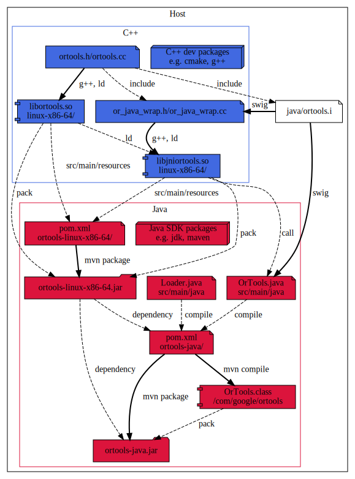
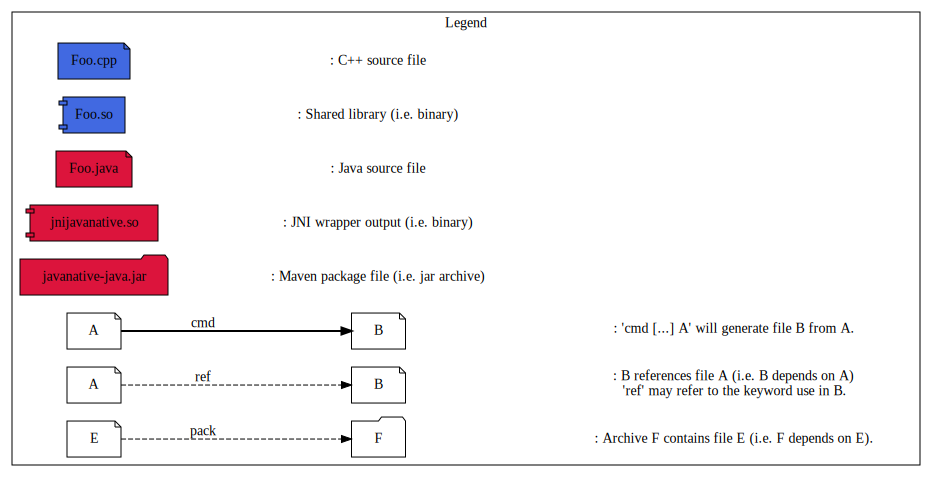

# Introduction

This is the documentation page for the Java wrapper of OR-Tools.

This project aim to explain how you build a Java 1.8 native (for win32-x86-64,
linux-x86-64 and darwin-x86-64) maven multiple package using [`mvn`](http://maven.apache.org/)
and few [POM.xml](http://maven.apache.org/pom.html).

## Table of Content

* [Requirement](#requirement)
* [Directory Layout](#directory-layout)
* [Build Process](#build-process)
  * [Local Package](#local-package)
  * [Building a native Package](#building-local-native-package)
  * [Building a Local Package](#building-local-package)
  * [Testing the Local Package](#testing-local-package)
* [Appendices](#appendices)
  * [Resources](#resources)
* [Misc](#misc)

## Requirement

You'll need a "Java SDK >= 1.8" and "Maven >= 3.6".

## Directory Layout

* [pom-native.xml.in](pom-native.xml.in) POM template to build the native
  project.
* [com/google/ortools/Loader.java](com/google/ortools/Loader.java) Helper to
  unpack and load the correct native libraries.
* [pom-local.xml.in](pom-local.xml.in) POM template to build the "pure" Java
  project.
* [pom-sample.xml.in](pom-sample.xml.in) POM template used to build samples
  and examples.
* [pom-test.xml.in](pom-test.xml.in) POM template used to build tests.

## Build Process

To Create a native dependent package we will split it in two parts:

* A bunch of `com.google.ortools:ortools-{platform}` maven packages for each
supported platform targeted and containing the native libraries.
* A java maven package `com.google.ortools:ortools-java` depending on the native
package and containing the Java code.

[`platform` names](https://github.com/java-native-access/jna/blob/cc1acdac02e4d0dda93ba01bbe3a3435b8933dab/test/com/sun/jna/PlatformTest.java#L31-L100)
come from the JNA project (Java Native Access) which will be use to find at
runtime on which platform the code is currently running.

### Local Package

The pipeline for `linux-x86-64` should be as follow: \
note: The pipeline will be similar for `darwin-x86-64` and `win32-x86-64`
architecture, don't hesitate to look at the CI log!
 

#### Building local native Package

Thus we have the C++ shared library `libortools.so` and the SWIG generated JNI
wrappers `libjniortools.so`.

So first let's create the local `com.google.ortools:ortools-{platform}.jar`
maven package.

Here some dev-note concerning this `POM.xml`.
* This package is a native package only containing native libraries.

Then you can generate the package and install it locally using:
```bash
mvn package
mvn install
```
note: this will automatically trigger the `mvn compile` phase.

If everything good the package (located in
`<buildir>/java/ortools-<platform>/target/`) should have this layout:
```
{...}/target/ortools-<platform>-1.0.jar:
\- <platform>
   \-libortools.so.8.0
   \-libjniortools.so
...
```
note: `<platform>` could be `linux-x86-64`, `darwin-x86-64` or `win32-x86-64`.

tips: since maven package are just zip archive you can use `unzip -l <package>.jar`
to study their layout.

#### Building local Package

So now, let's create the local `com.google.ortools:ortools-java.jar` maven
package which will depend on our previous native package.

Here some dev-note concerning this `POM.xml`.
* Add runtime dependency on each native package(s) available:
  ```xml
  <dependency>
    <groupId>com.google.ortools</groupId>
    <artifactId>ortools-linux-x86-64</artifactId>
    <version>[8.0,)</version>
    <type>jar</type>
    <scope>runtime</scope>
  </dependency>
  ```
  - Add dependency to jna so we can find at runtime the current `<platform>`:
  ```xml
  <dependency>
    <groupId>net.java.dev.jna</groupId>
    <artifactId>jna-platform</artifactId>
    <version>5.5.0</version>
  </dependency>
  ```

Then you can generate the package using:
```bash
mvn package
mvn install
```

If everything good the package (located in
`<buildir>/java/ortools-java/target/`) should have this layout:
```
{...}/target/ortools-java-8.0.jar:
\- com/
   \- google/
      \- ortools/
         \- Loader$PathConsumer.class
         \- Loader$1.class
         \- Loader.class
         \- constraintsolver/
            \- RoutingModel.class
            \- RoutingIndexManager.class
            \- ...
         \- ...
...
```

#### Testing local Package

We can test everything is working by using any sample project.

First you can build it using:
```
cmake --build build
```
note: `ortools-java` which is locally installed in the local maven cache
(`~/.m2/repository/com/google/ortools/ortools-java/...`).

Then you can run it using:
```sh
cmake --build build --target test
```
or manually using:
```
cd <builddir>/java/component/example
mvn compile
mvn exec:java
```

## Appendices

Few links on the subject...

### Resources

* [POM.xml reference](http://maven.apache.org/pom.html)
* [Maven Central POM requirement](https://central.sonatype.org/pages/requirements.html)
* [Maven Javadoc Plugin](https://maven.apache.org/plugins/maven-javadoc-plugin/)
* [Maven Source Plugin](https://maven.apache.org/plugins/maven-source-plugin/)
* [Maven GPG Plugin](https://maven.apache.org/plugins/maven-gpg-plugin/)
* [Java Native Access Project](https://github.com/java-native-access/jna)

## Misc

Image has been generated using [plantuml](http://plantuml.com/):
```bash
plantuml -Tsvg doc/{file}.dot
```
So you can find the dot source files in [doc](doc).
