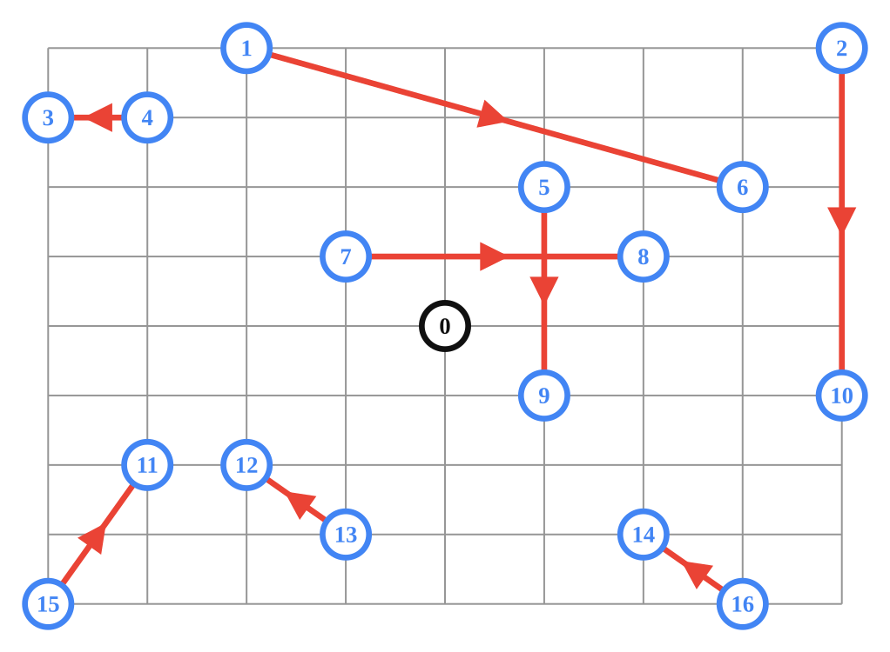
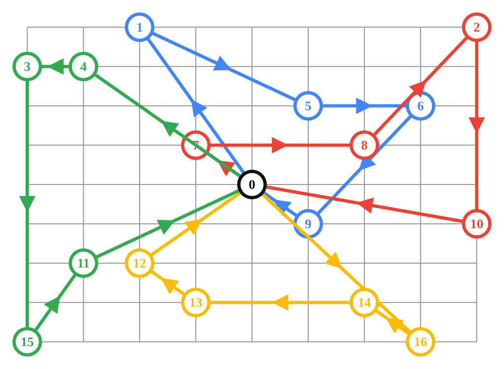
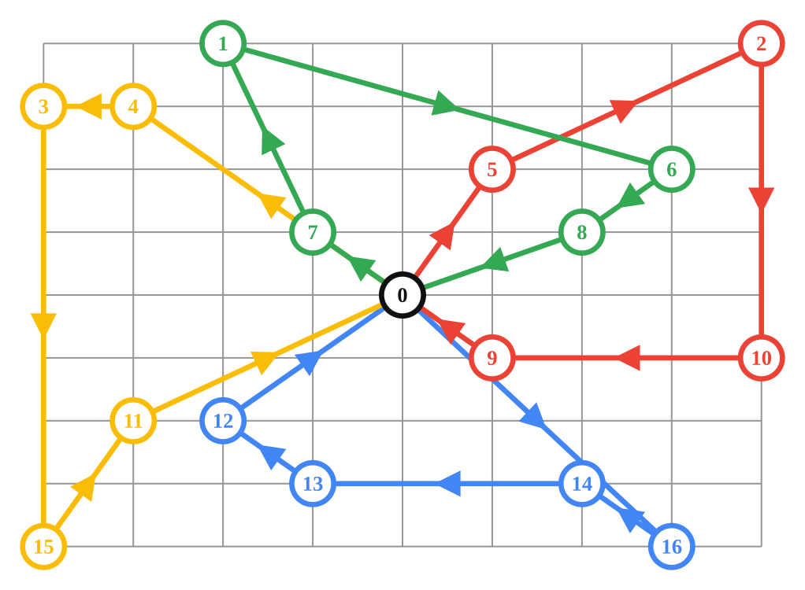

# Pickup & Delivery routing Problem recipes for the Vehicle Routing solver.

## Introduction

The Vehicle Routing solver can be used to solve various PDP.

## Pickup & Delivery Problem

Data Problem: 

Solution with the default Policy (ANY):

Samples:

*   [vrp_pickup_delivery.cc](/ortools/routing/samples/vrp_pickup_delivery.cc)
*   [vrp_pickup_delivery.py](/ortools/routing/samples/vrp_pickup_delivery.py)
*   [VrpPickupDelivery.java](/ortools/routing/samples/java/VrpPickupDelivery.java)
*   [VrpPickupDelivery.cs](/ortools/routing/samples/VrpPickupDelivery.cs)

### FIFO Policy

Solution with the FIFO Policy:

Samples:

*   [vrp_pickup_delivery_fifo.cc](/ortools/routing/samples/vrp_pickup_delivery_fifo.cc)
*   [vrp_pickup_delivery_fifo.py](/ortools/routing/samples/vrp_pickup_delivery_fifo.py)
*   [VrpPickupDeliveryFifo.java](/ortools/routing/samples/java/VrpPickupDeliveryFifo.java)
*   [VrpPickupDeliveryFifo.cs](/ortools/routing/samples/VrpPickupDeliveryFifo.cs)

### LIFO Policy

Solution with the LIFO Policy:

Samples:

*   [vrp_pickup_delivery_lifo.cc](/ortools/routing/samples/vrp_pickup_delivery_lifo.cc)
*   [vrp_pickup_delivery_lifo.py](/ortools/routing/samples/vrp_pickup_delivery_lifo.py)
*   [VrpPickupDeliveryLifo.java](/ortools/routing/samples/java/VrpPickupDeliveryLifo.java)
*   [VrpPickupDeliveryLifo.cs](/ortools/routing/samples/VrpPickupDeliveryLifo.cs)
