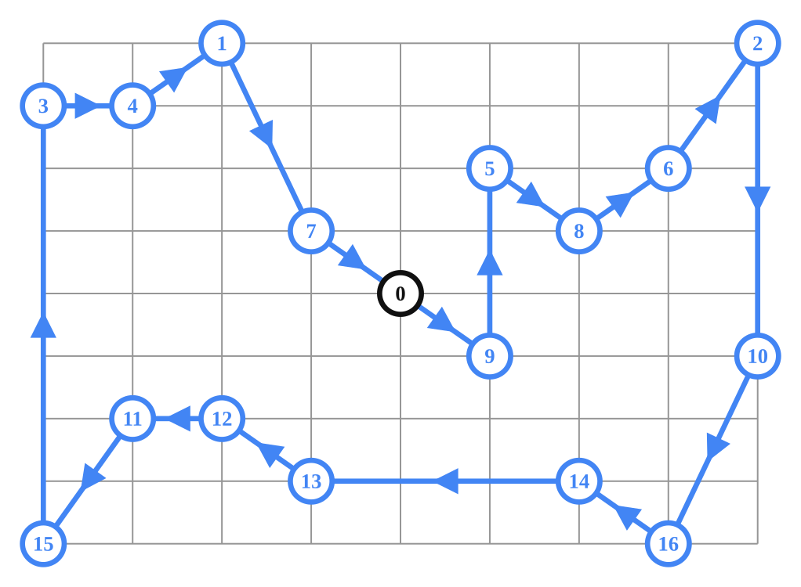
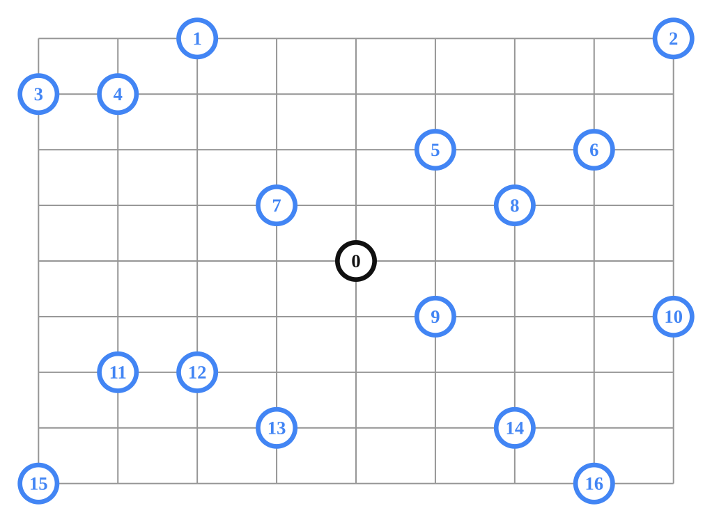

# Travelling Salesman Problem recipes for the Vehicle Routing solver.

## Introduction

The Vehicle Routing solver can be used to solve a Travelling Salesman Problem
(TSP).

## Using Locations

Data Problem: 

Solution: 

Samples:

*   [tsp.cc](/ortools/routing/samples/tsp.cc)
*   [tsp.py](/ortools/routing/samples/tsp.py)
*   [Tsp.java](/ortools/routing/samples/java/Tsp.java)
*   [Tsp.cs](/ortools/routing/samples/Tsp.cs)

## Using Distance Matrix

Data Problem: 

Solution: 

Samples:

*   [tsp_distance_matrix.cc](/ortools/routing/samples/tsp_distance_matrix.cc)
*   [tsp_distance_matrix.py](/ortools/routing/samples/tsp_distance_matrix.py)
*   [TspDistanceMatrix.java](/ortools/routing/samples/java/TspDistanceMatrix.java)
*   [TspDistanceMatrix.cs](/ortools/routing/samples/TspDistanceMatrix.cs)
