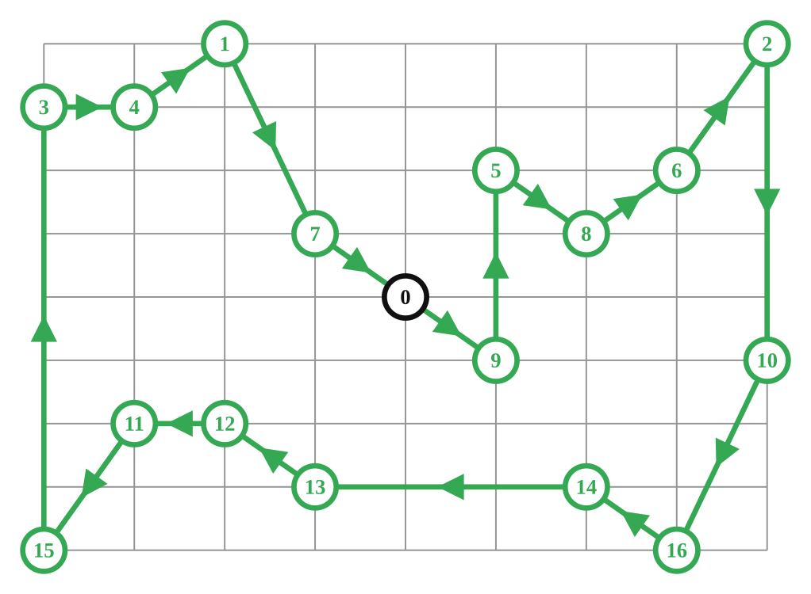
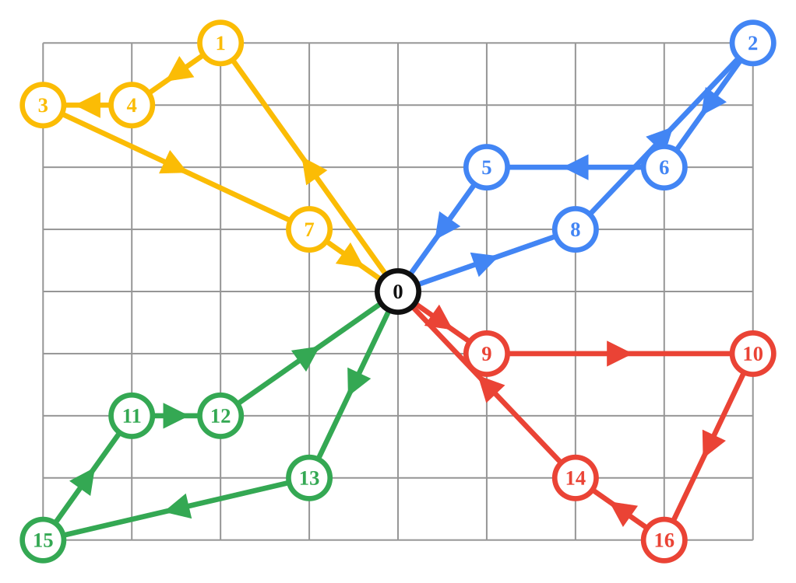
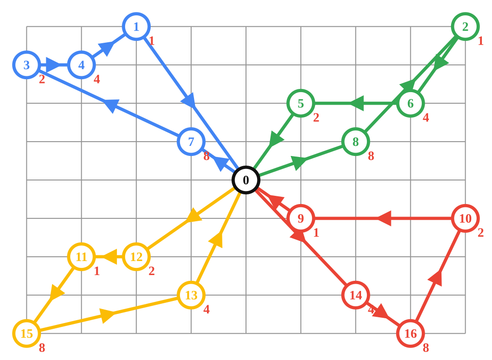
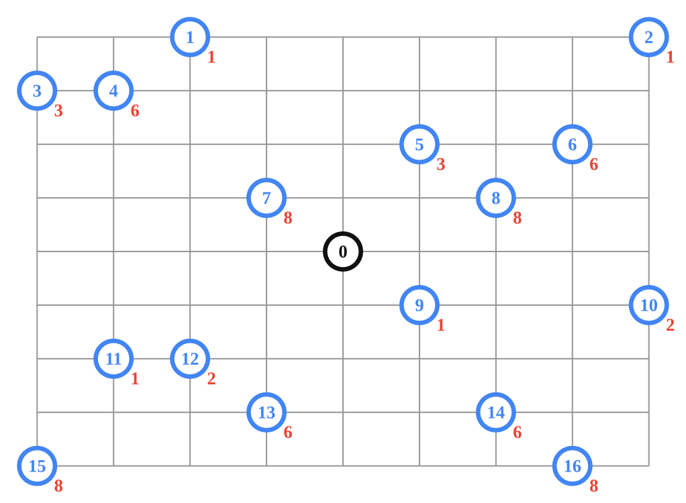
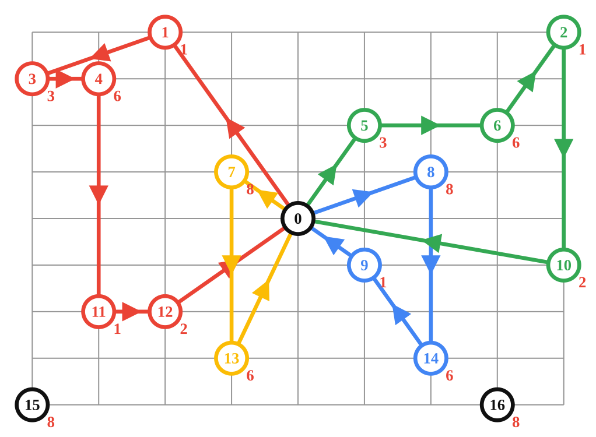
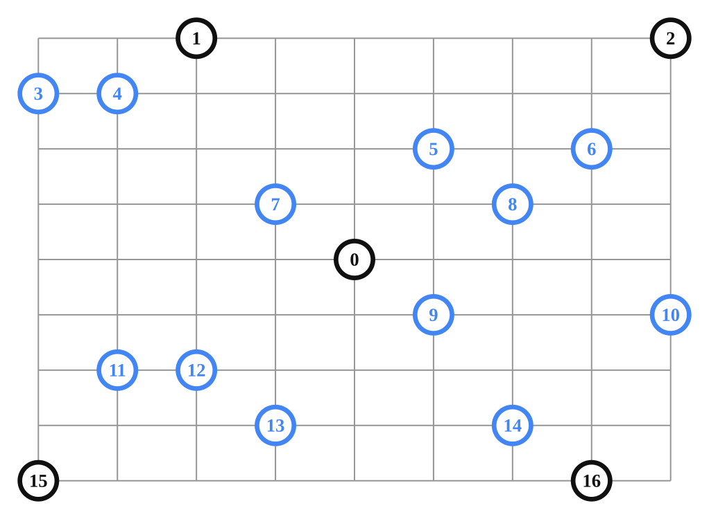
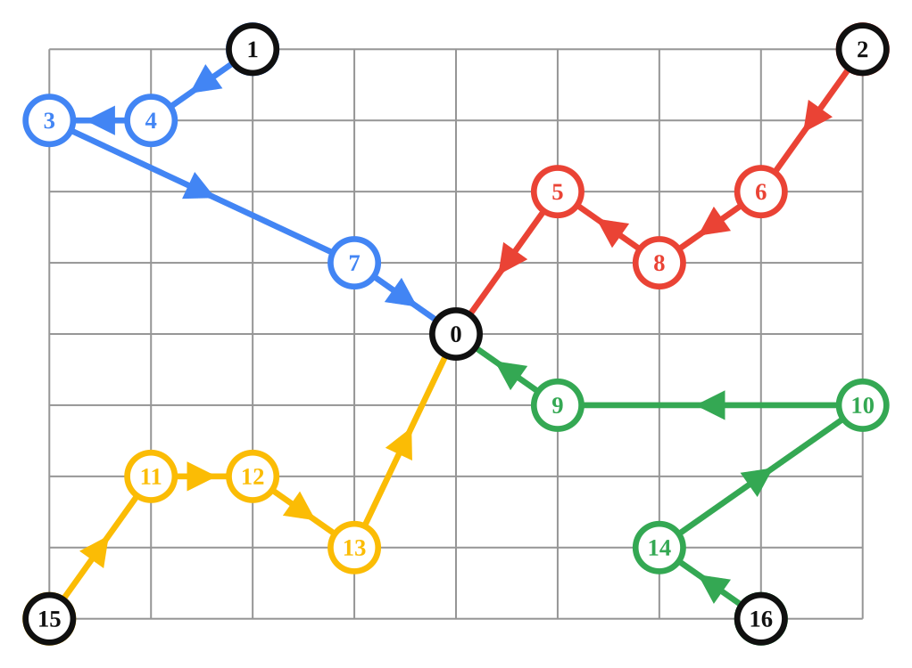
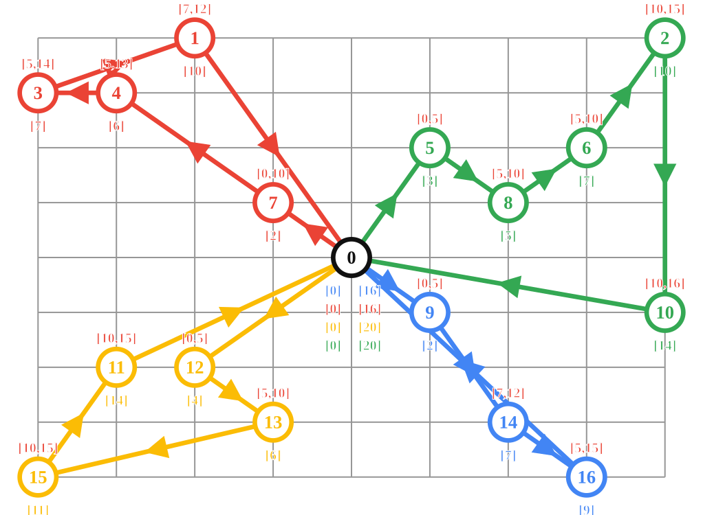
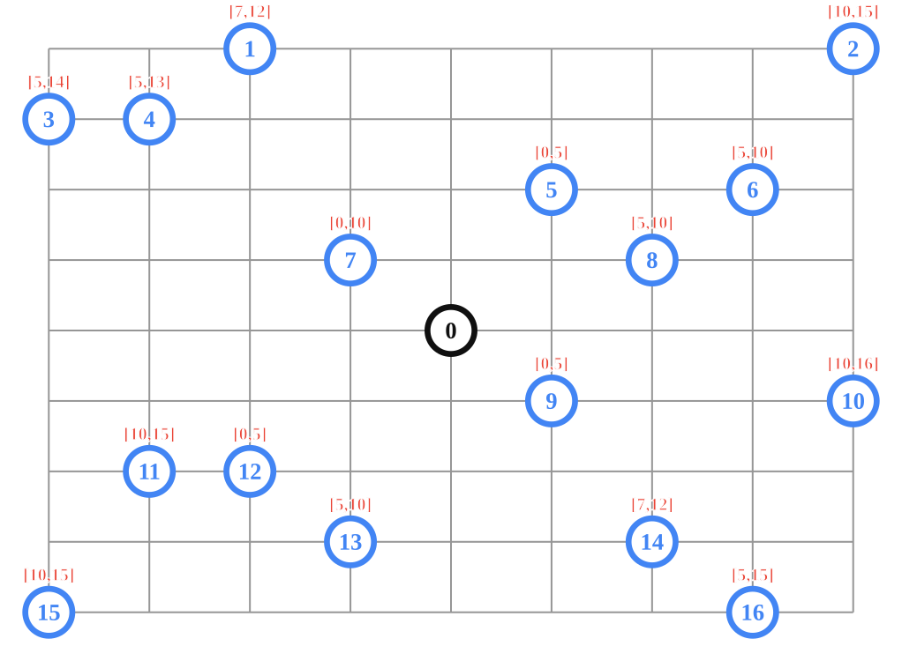
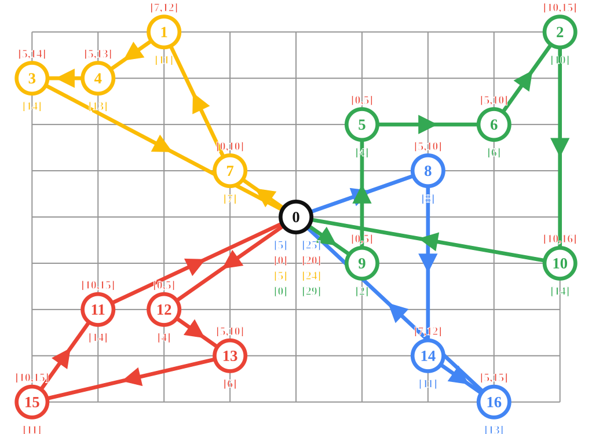

# Vehicle Routing Problem recipes for the Vehicle Routing solver.

## Introduction

The Vehicle Routing solver can be used to solve various VRP.

## Vehicle Routing Problem
Data Problem:

Solution:

Samples:

*   [vrp.cc](/ortools/constraint_solver/samples/vrp.cc)
*   [vrp.py](/ortools/constraint_solver/samples/vrp.py)
*   [Vrp.java](/ortools/routing/samples/java/Vrp.java)
*   [Vrp.cs](/ortools/constraint_solver/samples/Vrp.cs)

## Global Span Constraints
Data Problem:

Solution:

Samples:

*   [vrp_global_span.cc](/ortools/constraint_solver/samples/vrp_global_span.cc)
*   [vrp_global_span.py](/ortools/constraint_solver/samples/vrp_global_span.py)
*   [VrpGlobalSpan.java](/ortools/routing/samples/java/VrpGlobalSpan.java)
*   [VrpGlobalSpan.cs](/ortools/constraint_solver/samples/VrpGlobalSpan.cs)

## Capacity Constraints
Data Problem:

Solution:

Samples:

*   [vrp_capacity.cc](/ortools/constraint_solver/samples/vrp_capacity.cc)
*   [vrp_capacity.py](/ortools/constraint_solver/samples/vrp_capacity.py)
*   [VrpCapacity.java](/ortools/routing/samples/java/VrpCapacity.java)
*   [VrpCapacity.cs](/ortools/constraint_solver/samples/VrpCapacity.cs)

## Drop Nodes Constraints
Data Problem:

Solution:

Samples:

*   [vrp_drop_nodes.cc](/ortools/constraint_solver/samples/vrp_drop_nodes.cc)
*   [vrp_drop_nodes.py](/ortools/constraint_solver/samples/vrp_drop_nodes.py)
*   [VrpDropNodes.java](/ortools/routing/samples/java/VrpDropNodes.java)
*   [VrpDropNodes.cs](/ortools/constraint_solver/samples/VrpDropNodes.cs)

## Multiple Starts Ends
Data Problem:

Solution:

Samples:

*   [vrp_starts_ends.cc](/ortools/constraint_solver/samples/vrp_starts_ends.cc)
*   [vrp_starts_ends.py](/ortools/constraint_solver/samples/vrp_starts_ends.py)
*   [VrpStartsEnds.java](/ortools/routing/samples/java/VrpStartsEnds.java)
*   [VrpStartsEnds.cs](/ortools/constraint_solver/samples/VrpStartsEnds.cs)

## Time Window Constraints
Data Problem:

Solution:

Samples:

*   [vrp_time_windows.cc](/ortools/constraint_solver/samples/vrp_time_windows.cc)
*   [vrp_time_windows.py](/ortools/constraint_solver/samples/vrp_time_windows.py)
*   [VrpTimeWindows.java](/ortools/routing/samples/java/VrpTimeWindows.java)
*   [VrpTimeWindows.cs](/ortools/constraint_solver/samples/VrpTimeWindows.cs)

## Resource Constraints
Data Problem:

Solution:

Samples:

*   [vrp_resources.cc](/ortools/constraint_solver/samples/vrp_resources.cc)
*   [vrp_resources.py](/ortools/constraint_solver/samples/vrp_resources.py)
*   [VrpResources.java](/ortools/routing/samples/java/VrpResources.java)
*   [VrpResources.cs](/ortools/constraint_solver/samples/VrpResources.cs)
