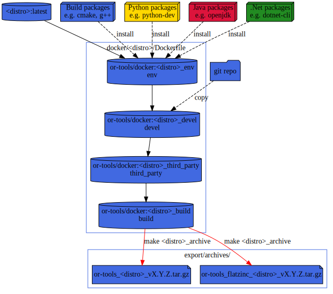

# CI: Makefile/Docker testing
To test the build on various distro, we are using docker containers and a Makefile for orchestration.

pros:
* You are independent of third party CI runner config (e.g. github actions runners or Travis-CI VM images).
* You can run it locally on any unix system.
* Most CI provide runner with docker and Makefile installed.

cons:
* Only GNU/Linux distro supported.
* Could take few GiB (~30 GiB for all distro and all languages)
  * ~500MiB OS + C++/CMake tools,
  * ~150 MiB Python, wheel,

# Usage
To get the help simply type:
```sh
make
```

note: you can also use from top directory
```sh
make --directory=tools/docker
```

## Example
For example to test inside an `Alpine` container:
```sh
make alpine-edge_test
```

# Docker layers
Dockerfile is splitted in several stages.



## Docker aarch64 on x86_64 machine
You can build and run aarch64 docker container on a x86_64 by enabling qemu support:

```sh
docker run --rm --privileged multiarch/qemu-user-static --reset -p yes
```

ref: https://github.com/multiarch/qemu-user-static#getting-started
